# Barres

Le graphique en barres verticales. Les variations couvrent l'empilement (aucun / empilé / 100 %), l'affichage des valeurs, la légende, les étiquettes d'axes, le tri, l'objectif et la courbe de tendance.

**Jeu de données :** `Pays, Catégorie, Ventes` (15 lignes) éclaté par catégorie, sauf mention contraire.

| Fichier | Variante | Ce qui change |
| --- | --- | --- |
| `01-groupees.png` | Groupées (défaut) | Réglages par défaut : barres côte à côte, aucune valeur affichée, légende visible. |
| `02-groupees-avec-valeurs.png` | Groupées + valeurs | « Afficher les valeurs sur les points de données » activé : le chiffre est écrit au-dessus de chaque barre. |
| `03-groupees-sans-legende.png` | Groupées sans légende | « Afficher la légende » désactivé : les séries restent colorées mais ne sont plus nommées. |
| `04-empilees.png` | Empilées | Empilement = « Empiler » : les séries s'additionnent dans une seule barre par catégorie, en valeur absolue. |
| `05-empilees-avec-valeurs.png` | Empilées + valeurs | Empilé avec les valeurs écrites à l'intérieur de chaque segment. |
| `06-empilees-avec-totaux.png` | Empilées + totaux | Empilé avec « Afficher les totaux d'empilement » : le total de la pile est écrit au-dessus de la barre. |
| `07-empilees-100.png` | Empilées 100 % | Empilement = « 100 % » : chaque barre est ramenée à 100, l'axe Y est en pourcentage — on lit des parts, plus des volumes. |
| `08-empilees-100-avec-valeurs.png` | Empilées 100 % + valeurs | Idem, avec le pourcentage écrit dans chaque segment. |
| `09-serie-unique.png` | Série unique | Une seule mesure (`Commandes` par année) : la légende disparaît d'elle-même, le nom de la série sert de titre d'axe Y. |
| `10-serie-unique-avec-valeurs.png` | Série unique + valeurs | Même graphique avec les valeurs au-dessus des barres. |
| `11-avec-ligne-objectif.png` | Ligne d'objectif | « Ligne d'objectif » = 250 : une ligne pointillée étiquetée traverse le graphique. |
| `12-avec-courbe-tendance.png` | Courbe de tendance | « Courbe de tendance » activée : régression linéaire en pointillés par-dessus les barres. |
| `13-triees-valeur-decroissante.png` | Triées par valeur | Tri = valeur décroissante sur 15 communes : les libellés d'axe X pivotent automatiquement quand ils ne tiennent plus à l'horizontale. |
| `14-sans-etiquettes-axes.png` | Sans étiquettes d'axes | Libellés et graduations des deux axes coupés, valeurs affichées à la place : la version « épurée » pour un tableau de bord. |
| `15-avec-titres-axes.png` | Titres d'axes personnalisés | Titres d'axes saisis à la main (« Exercice » / « Nombre de commandes ») au lieu du nom de colonne. |
| `16-valeurs-compactes.png` | Valeurs compactes | Mise en forme des étiquettes = « Compact » : 92 000 s'écrit 92 k. Utile quand les nombres sont longs. |
| `17-echelle-logarithmique.png` | Échelle logarithmique | Axe Y logarithmique : les petites communes redeviennent lisibles à côté de Lyon. |
| `18-deux-mesures.png` | Deux mesures | Deux colonnes de valeurs (`Commandes` et `Revenu`) au lieu d'un éclatement : une série par mesure, sur le même axe. |
| `19-couleurs-personnalisees.png` | Couleurs personnalisées | Couleur par série choisie dans la palette d'accents Metabase, au lieu de l'ordre par défaut. |

---

### Groupées (défaut) — `01-groupees.png`

Réglages par défaut : barres côte à côte, aucune valeur affichée, légende visible.

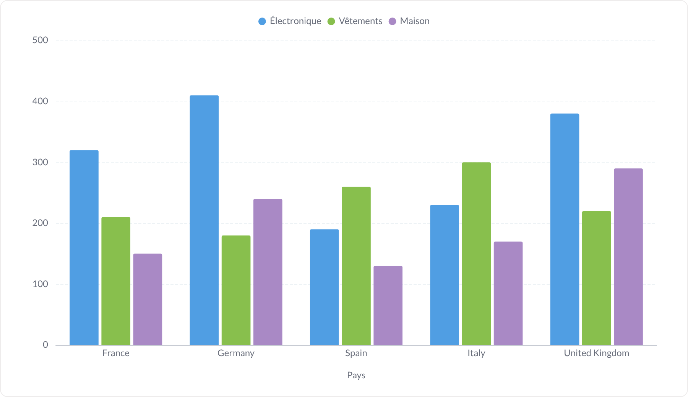

### Groupées + valeurs — `02-groupees-avec-valeurs.png`

« Afficher les valeurs sur les points de données » activé : le chiffre est écrit au-dessus de chaque barre.

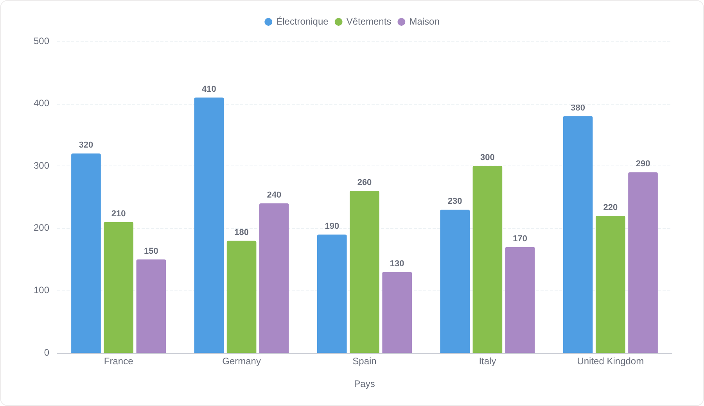

### Groupées sans légende — `03-groupees-sans-legende.png`

« Afficher la légende » désactivé : les séries restent colorées mais ne sont plus nommées.

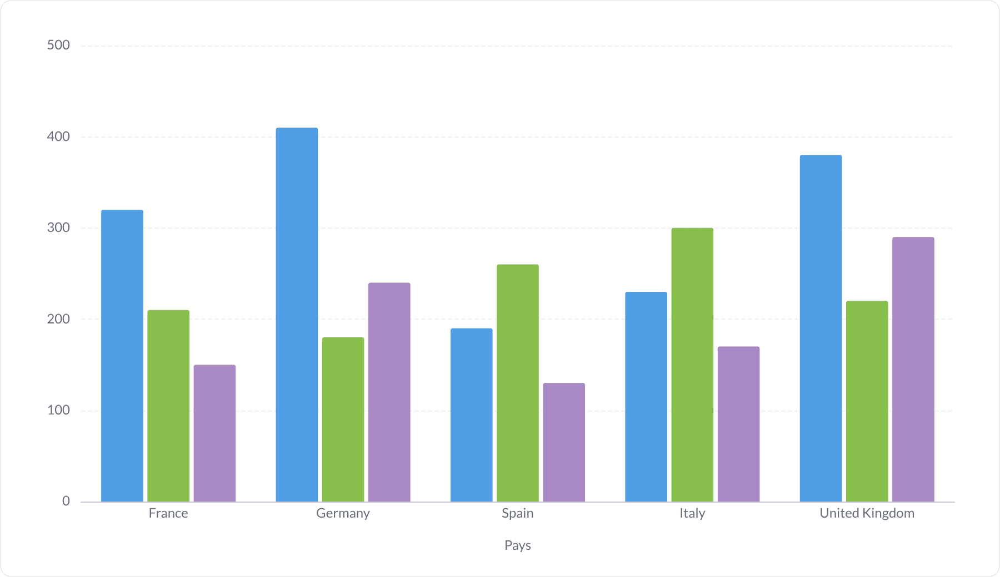

### Empilées — `04-empilees.png`

Empilement = « Empiler » : les séries s'additionnent dans une seule barre par catégorie, en valeur absolue.

### Empilées + valeurs — `05-empilees-avec-valeurs.png`

Empilé avec les valeurs écrites à l'intérieur de chaque segment.

### Empilées + totaux — `06-empilees-avec-totaux.png`

Empilé avec « Afficher les totaux d'empilement » : le total de la pile est écrit au-dessus de la barre.

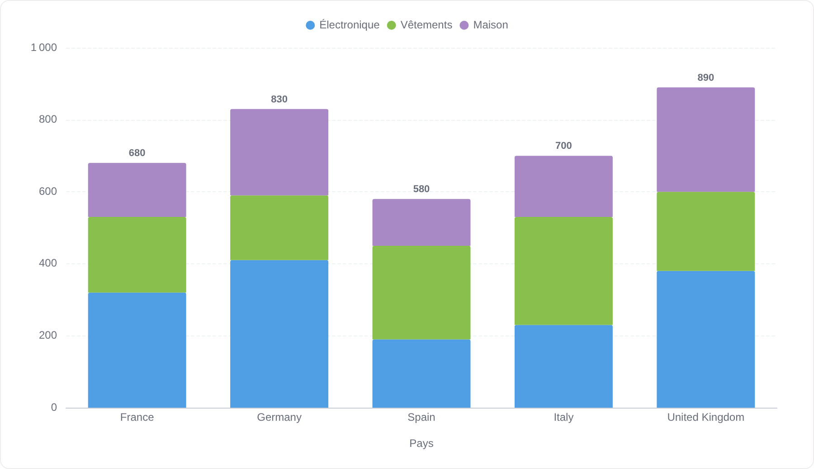

### Empilées 100 % — `07-empilees-100.png`

Empilement = « 100 % » : chaque barre est ramenée à 100, l'axe Y est en pourcentage — on lit des parts, plus des volumes.

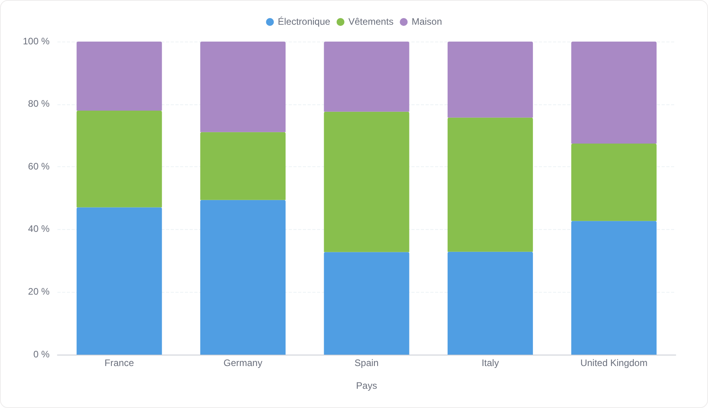

### Empilées 100 % + valeurs — `08-empilees-100-avec-valeurs.png`

Idem, avec le pourcentage écrit dans chaque segment.

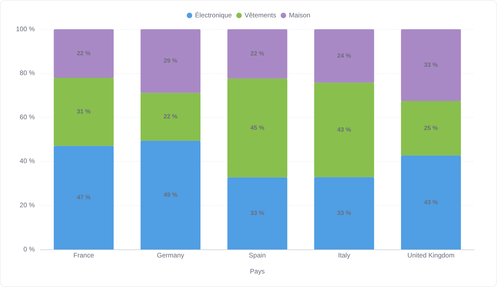

### Série unique — `09-serie-unique.png`

Une seule mesure (`Commandes` par année) : la légende disparaît d'elle-même, le nom de la série sert de titre d'axe Y.

### Série unique + valeurs — `10-serie-unique-avec-valeurs.png`

Même graphique avec les valeurs au-dessus des barres.

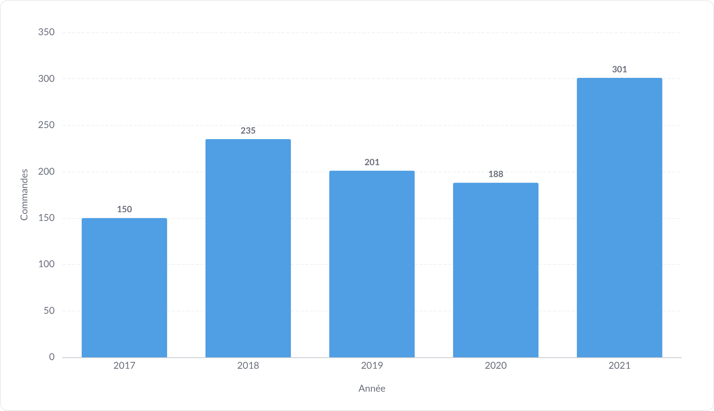

### Ligne d'objectif — `11-avec-ligne-objectif.png`

« Ligne d'objectif » = 250 : une ligne pointillée étiquetée traverse le graphique.

### Courbe de tendance — `12-avec-courbe-tendance.png`

« Courbe de tendance » activée : régression linéaire en pointillés par-dessus les barres.

### Triées par valeur — `13-triees-valeur-decroissante.png`

Tri = valeur décroissante sur 15 communes : les libellés d'axe X pivotent automatiquement quand ils ne tiennent plus à l'horizontale.

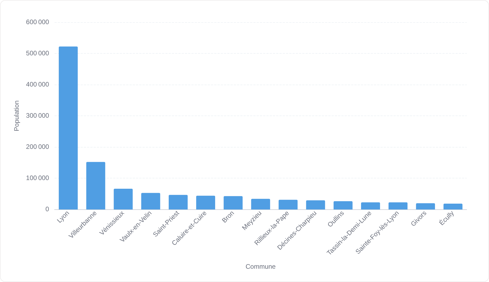

### Sans étiquettes d'axes — `14-sans-etiquettes-axes.png`

Libellés et graduations des deux axes coupés, valeurs affichées à la place : la version « épurée » pour un tableau de bord.

### Titres d'axes personnalisés — `15-avec-titres-axes.png`

Titres d'axes saisis à la main (« Exercice » / « Nombre de commandes ») au lieu du nom de colonne.

### Valeurs compactes — `16-valeurs-compactes.png`

Mise en forme des étiquettes = « Compact » : 92 000 s'écrit 92 k. Utile quand les nombres sont longs.

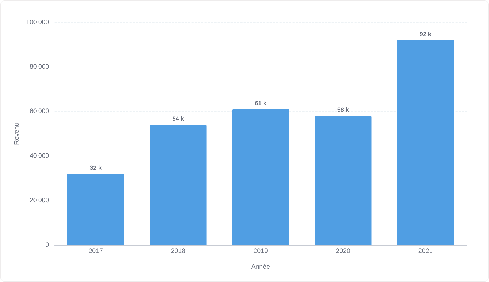

### Échelle logarithmique — `17-echelle-logarithmique.png`

Axe Y logarithmique : les petites communes redeviennent lisibles à côté de Lyon.

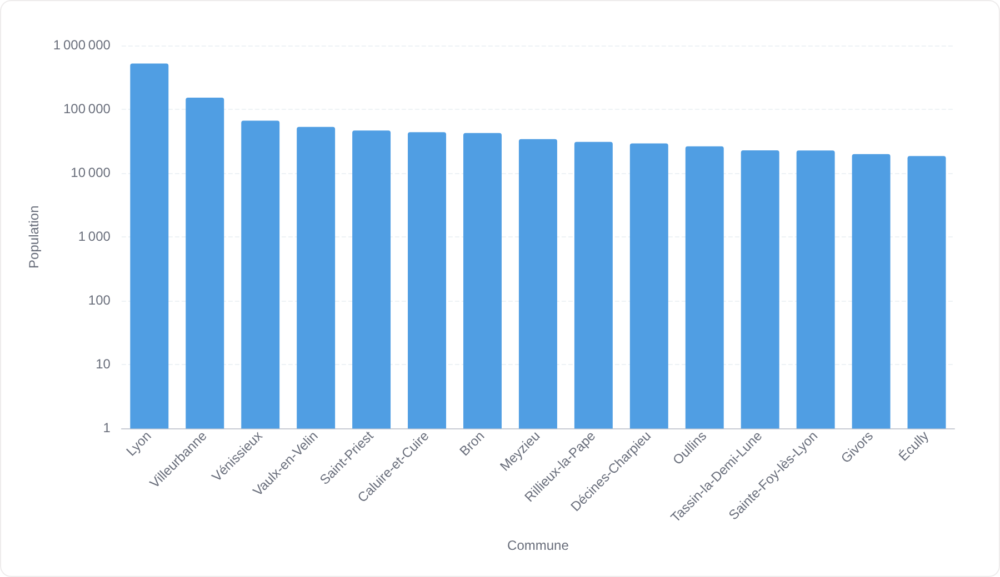

### Deux mesures — `18-deux-mesures.png`

Deux colonnes de valeurs (`Commandes` et `Revenu`) au lieu d'un éclatement : une série par mesure, sur le même axe.

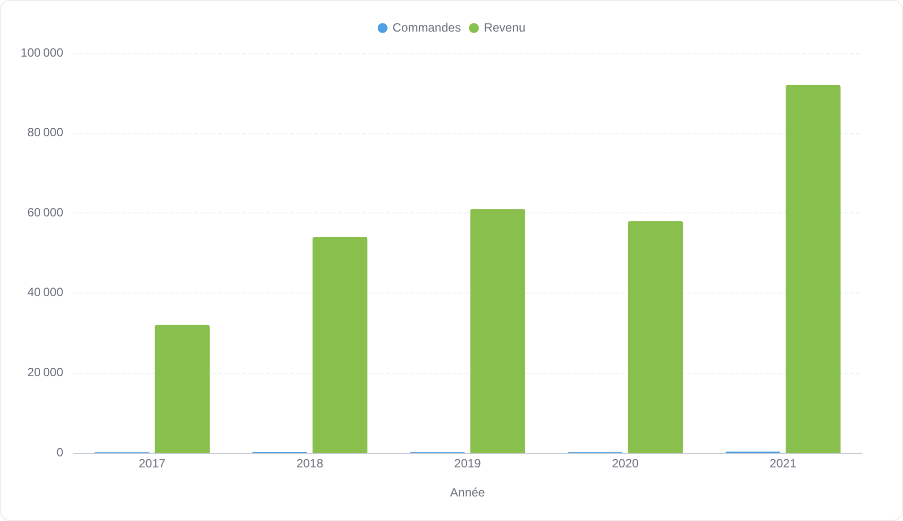

### Couleurs personnalisées — `19-couleurs-personnalisees.png`

Couleur par série choisie dans la palette d'accents Metabase, au lieu de l'ordre par défaut.

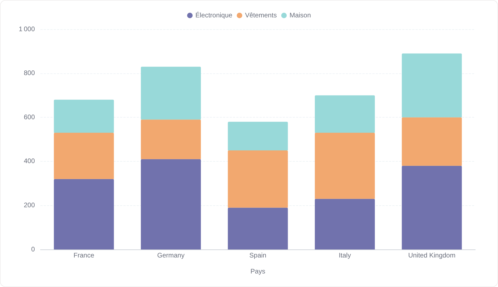
