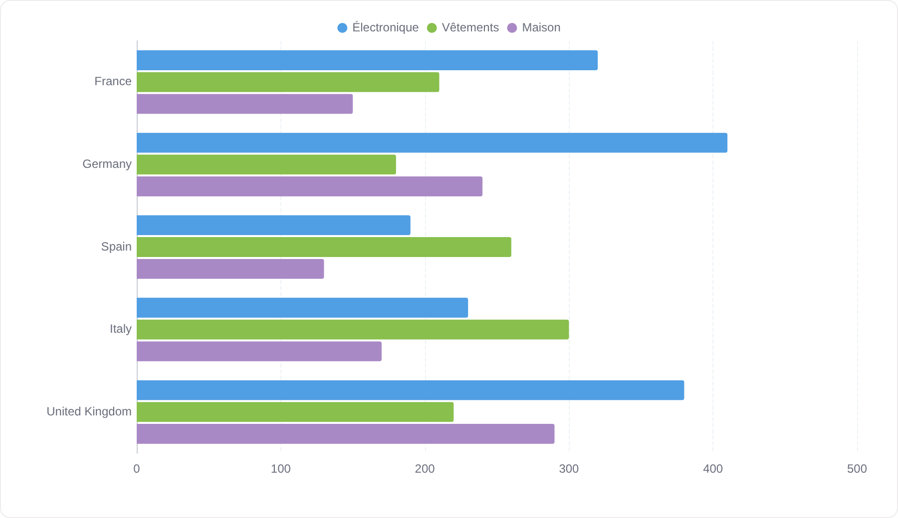
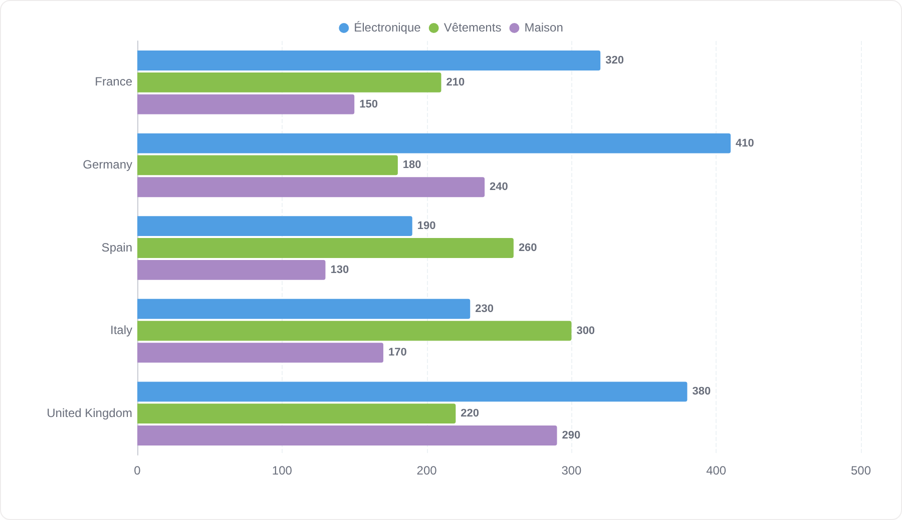
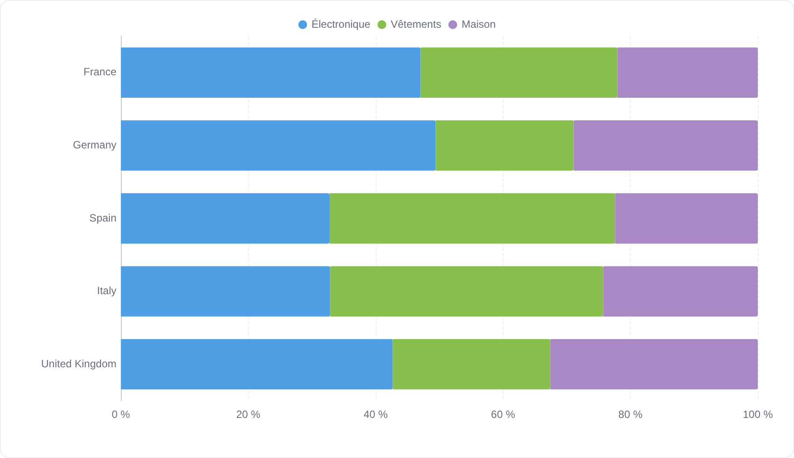
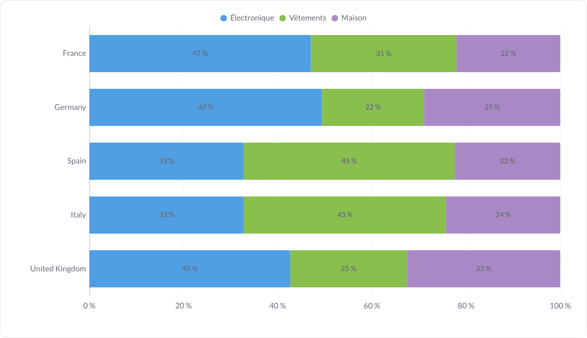
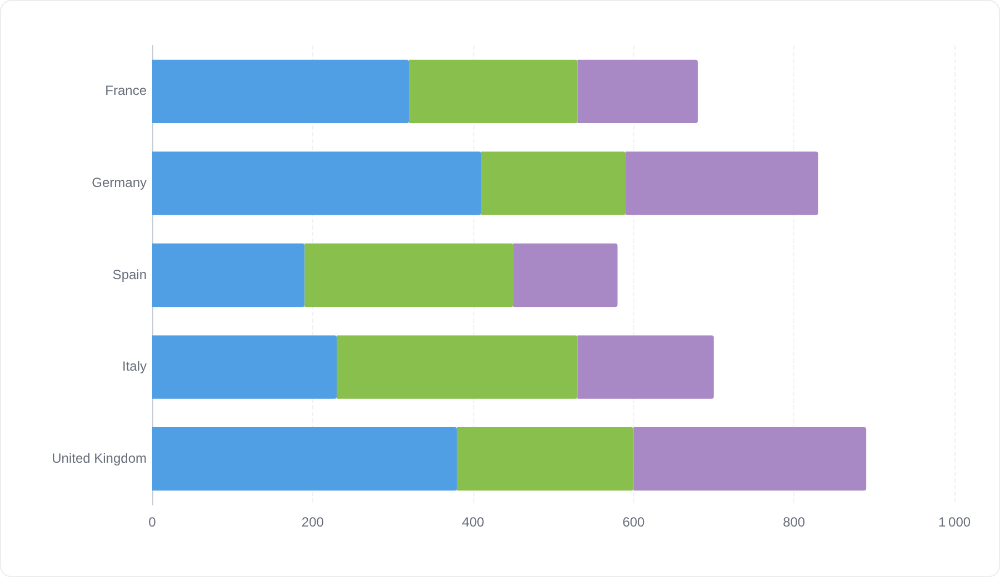
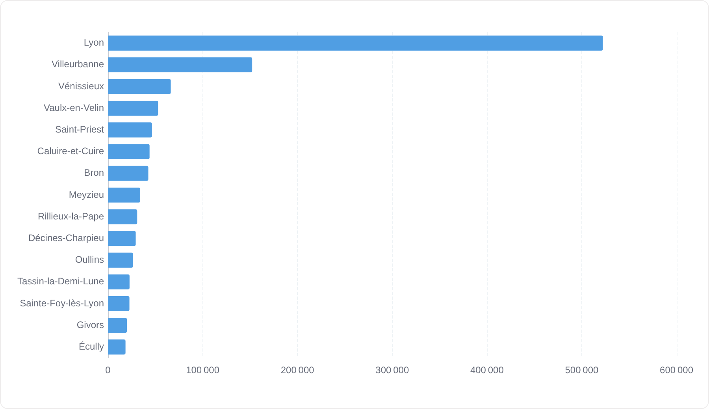
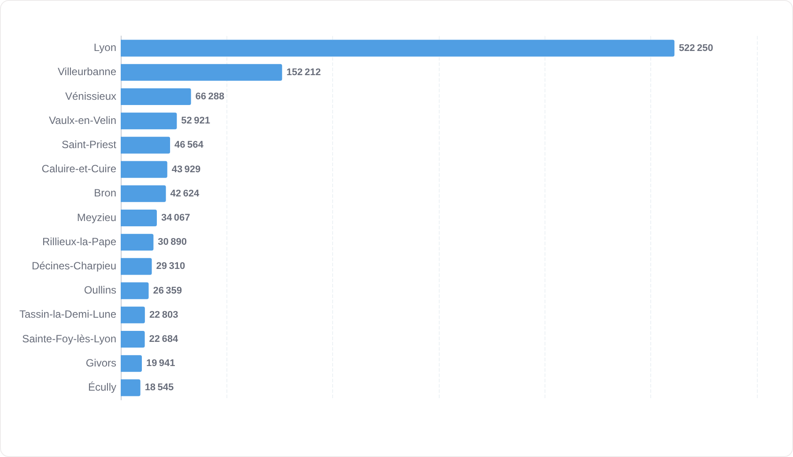

# Barres horizontales

Le même graphique couché : les catégories descendent le long de l'axe Y, ce qui laisse la place à des libellés longs.

**Jeu de données :** `Pays, Catégorie, Ventes`, éclaté par catégorie ; les deux dernières utilisent les 15 communes du Grand Lyon.

| Fichier | Variante | Ce qui change |
| --- | --- | --- |
| `01-defaut.png` | Défaut | Barres groupées horizontalement, légende visible, pas de valeurs. |
| `02-avec-valeurs.png` | Avec valeurs | Valeurs écrites au bout de chaque barre. |
| `03-empilees.png` | Empilées | Empilement = « Empiler » : une barre par pays, segmentée par catégorie. |
| `04-empilees-avec-valeurs.png` | Empilées + valeurs | Empilé, valeurs écrites dans les segments. |
| `05-empilees-100.png` | Empilées 100 % | Empilement = « 100 % » : toutes les barres font la même longueur, l'axe est en pourcentage. |
| `06-empilees-100-avec-valeurs.png` | Empilées 100 % + valeurs | Idem, avec le pourcentage dans chaque segment. |
| `07-sans-legende.png` | Sans légende | Empilé sans légende. |
| `08-serie-unique-triee.png` | Série unique triée | Un classement : une mesure, tri par valeur décroissante, libellés à gauche. |
| `09-sans-etiquettes-axes.png` | Sans étiquettes de valeurs | Graduations de l'axe des valeurs coupées, valeurs écrites au bout des barres. |

---

### Défaut — `01-defaut.png`

Barres groupées horizontalement, légende visible, pas de valeurs.

### Avec valeurs — `02-avec-valeurs.png`

Valeurs écrites au bout de chaque barre.

### Empilées — `03-empilees.png`

Empilement = « Empiler » : une barre par pays, segmentée par catégorie.

### Empilées + valeurs — `04-empilees-avec-valeurs.png`

Empilé, valeurs écrites dans les segments.

### Empilées 100 % — `05-empilees-100.png`

Empilement = « 100 % » : toutes les barres font la même longueur, l'axe est en pourcentage.

### Empilées 100 % + valeurs — `06-empilees-100-avec-valeurs.png`

Idem, avec le pourcentage dans chaque segment.

### Sans légende — `07-sans-legende.png`

Empilé sans légende.

### Série unique triée — `08-serie-unique-triee.png`

Un classement : une mesure, tri par valeur décroissante, libellés à gauche.

### Sans étiquettes de valeurs — `09-sans-etiquettes-axes.png`

Graduations de l'axe des valeurs coupées, valeurs écrites au bout des barres.

