# Courbe

La courbe, sur un vrai axe temporel. Les variations portent surtout sur la forme du trait, les points, les axes et les repères (objectif, tendance).

**Jeu de données :** `Date, Visiteurs, Conversions` — 12 mois de 2023.

| Fichier | Variante | Ce qui change |
| --- | --- | --- |
| `01-defaut.png` | Défaut | Deux séries, trait droit, points visibles, légende en haut. |
| `02-avec-valeurs.png` | Avec valeurs | Valeur écrite au-dessus de chaque point. |
| `03-sans-legende.png` | Sans légende | Légende masquée. |
| `04-lissee.png` | Ligne lissée | Forme de la ligne = « courbée » sur les deux séries. |
| `05-en-escalier.png` | En escalier | Forme de la ligne = « en escalier » : la valeur tient jusqu'au point suivant. |
| `06-pointillee.png` | Pointillée | Style de ligne = « tirets », par exemple pour une série prévisionnelle. |
| `07-sans-points.png` | Sans points | « Afficher les points sur les lignes » = désactivé : trait nu. |
| `08-ligne-epaisse.png` | Ligne épaisse | Taille de ligne = L sur la série principale, S sur la secondaire : la hiérarchie se lit tout de suite. |
| `09-deux-axes-y.png` | Deux axes Y | `Conversions` renvoyée sur l'axe de droite : deux ordres de grandeur cohabitent sans écraser l'un des deux. |
| `10-serie-unique.png` | Série unique | Une seule mesure : plus de légende, le nom de la série passe en titre d'axe Y. |
| `11-avec-ligne-objectif.png` | Ligne d'objectif | Objectif à 2 000 visiteurs : ligne pointillée étiquetée. |
| `12-avec-courbe-tendance.png` | Courbe de tendance | Régression linéaire ajoutée en pointillés à la couleur de la série. |
| `13-sans-etiquettes-axes.png` | Sans étiquettes d'axes | Axes muets : il ne reste que la forme de la courbe (usage type sparkline agrandie). |
| `14-valeurs-compactes.png` | Valeurs compactes | Valeurs affichées en notation compacte (2,5 k au lieu de 2 510). |

---

### Défaut — `01-defaut.png`

Deux séries, trait droit, points visibles, légende en haut.

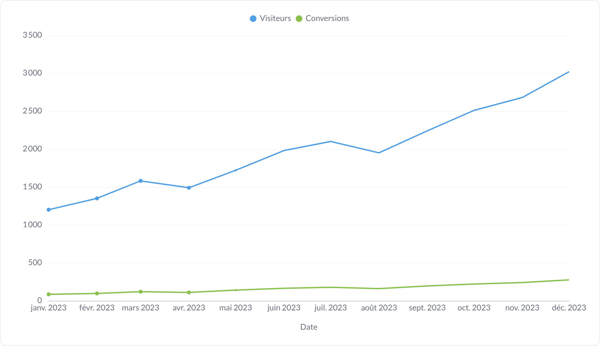

### Avec valeurs — `02-avec-valeurs.png`

Valeur écrite au-dessus de chaque point.

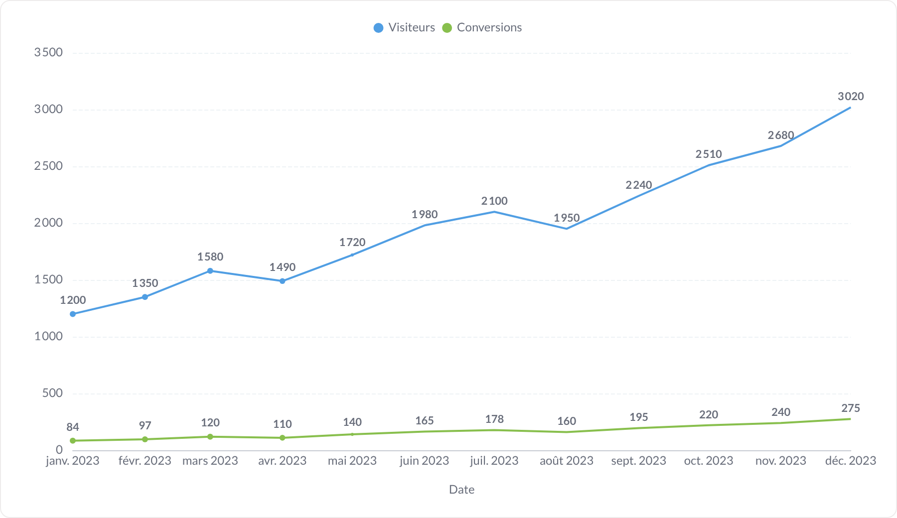

### Sans légende — `03-sans-legende.png`

Légende masquée.

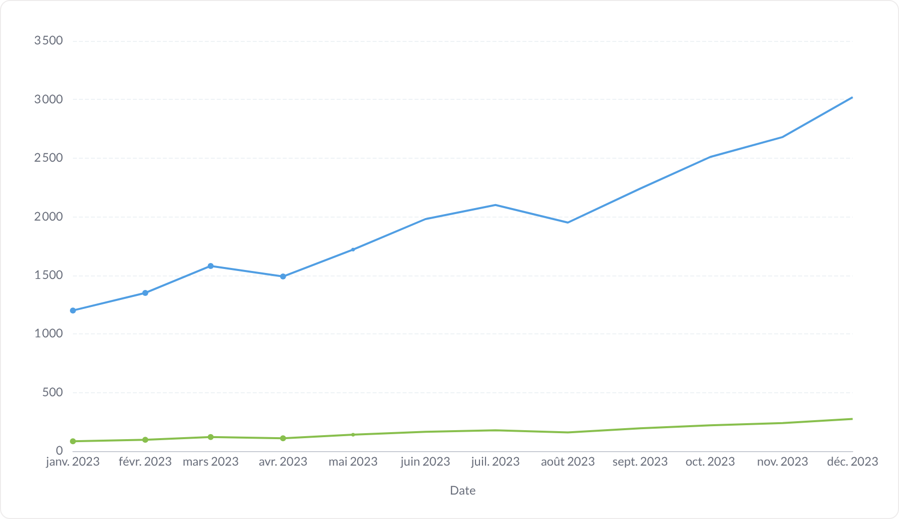

### Ligne lissée — `04-lissee.png`

Forme de la ligne = « courbée » sur les deux séries.

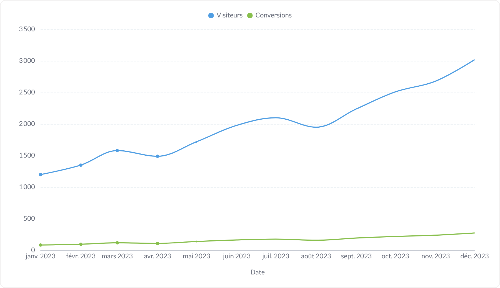

### En escalier — `05-en-escalier.png`

Forme de la ligne = « en escalier » : la valeur tient jusqu'au point suivant.

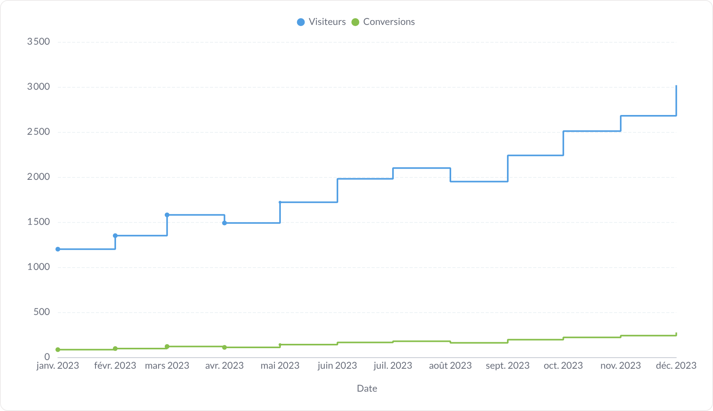

### Pointillée — `06-pointillee.png`

Style de ligne = « tirets », par exemple pour une série prévisionnelle.

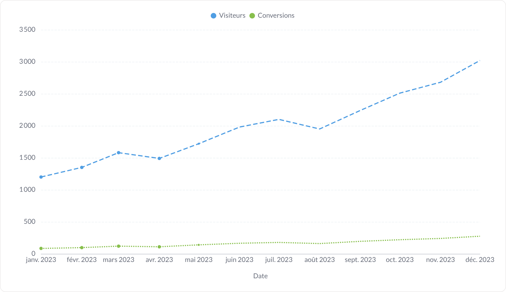

### Sans points — `07-sans-points.png`

« Afficher les points sur les lignes » = désactivé : trait nu.

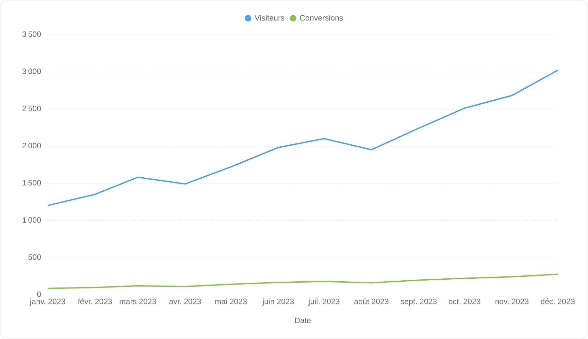

### Ligne épaisse — `08-ligne-epaisse.png`

Taille de ligne = L sur la série principale, S sur la secondaire : la hiérarchie se lit tout de suite.

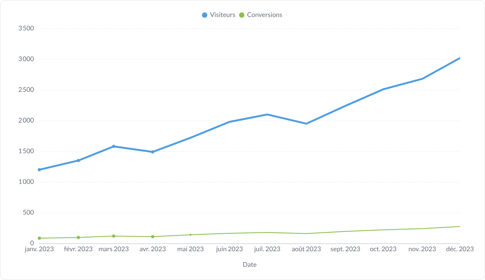

### Deux axes Y — `09-deux-axes-y.png`

`Conversions` renvoyée sur l'axe de droite : deux ordres de grandeur cohabitent sans écraser l'un des deux.

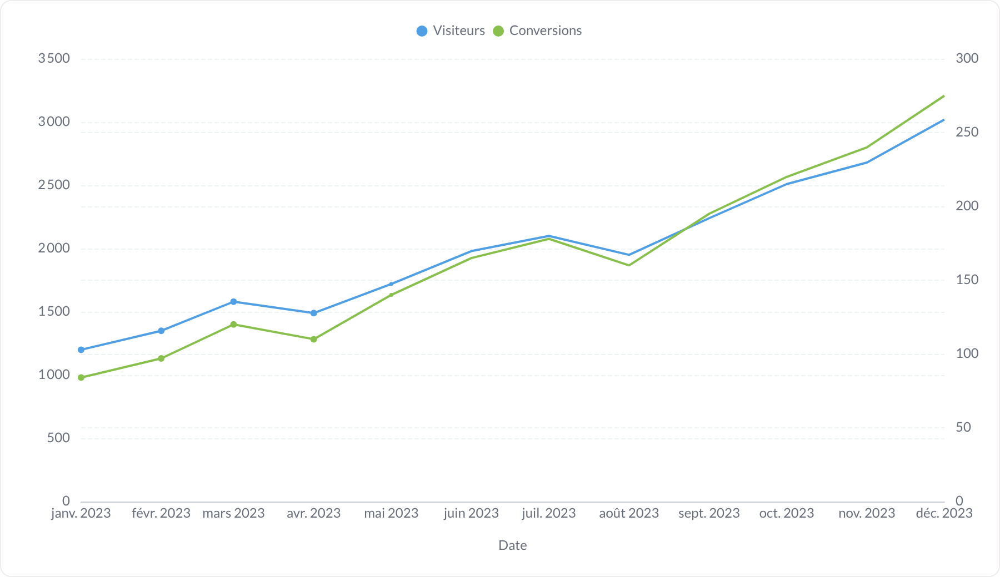

### Série unique — `10-serie-unique.png`

Une seule mesure : plus de légende, le nom de la série passe en titre d'axe Y.

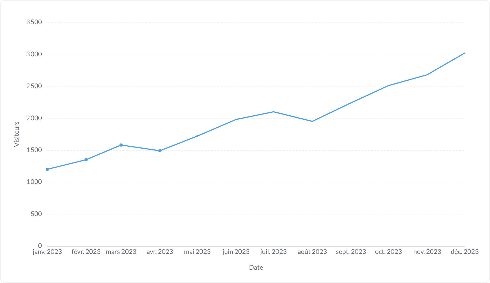

### Ligne d'objectif — `11-avec-ligne-objectif.png`

Objectif à 2 000 visiteurs : ligne pointillée étiquetée.

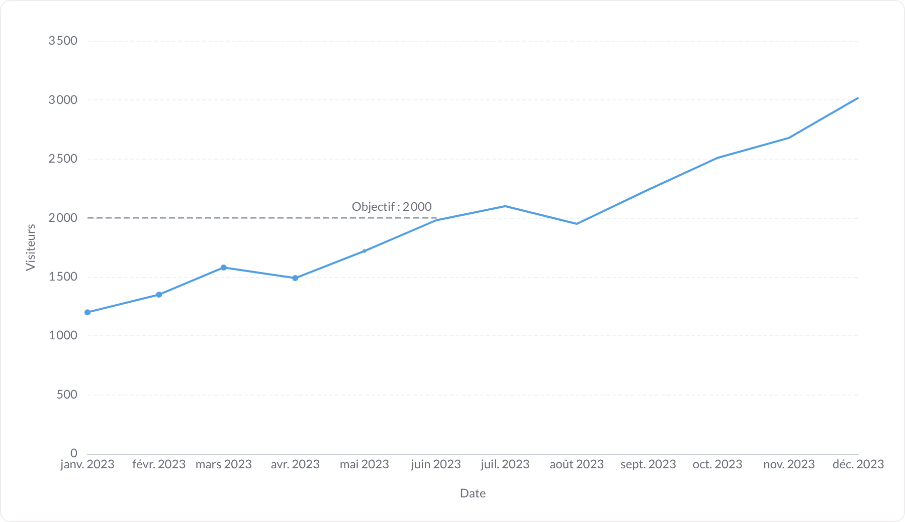

### Courbe de tendance — `12-avec-courbe-tendance.png`

Régression linéaire ajoutée en pointillés à la couleur de la série.

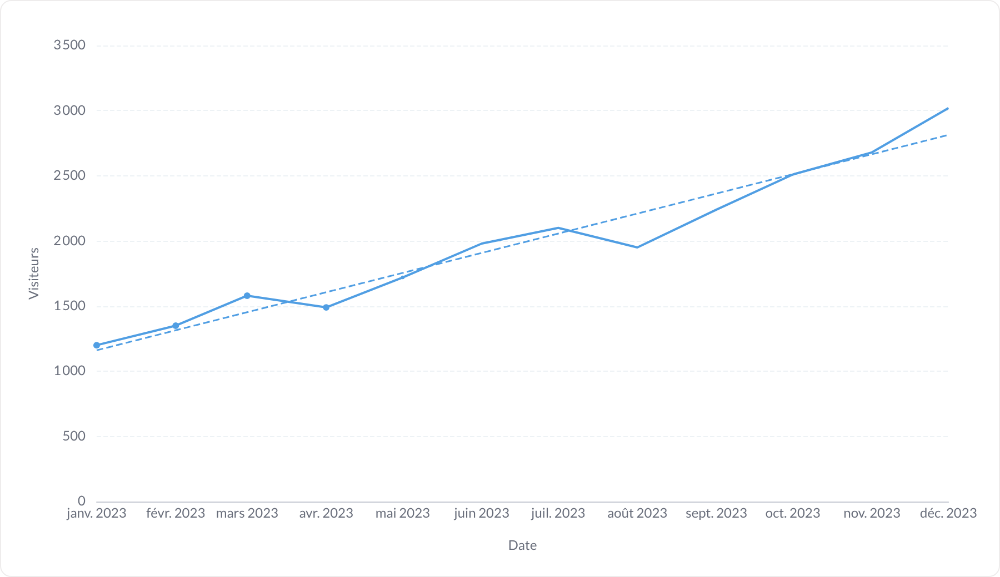

### Sans étiquettes d'axes — `13-sans-etiquettes-axes.png`

Axes muets : il ne reste que la forme de la courbe (usage type sparkline agrandie).

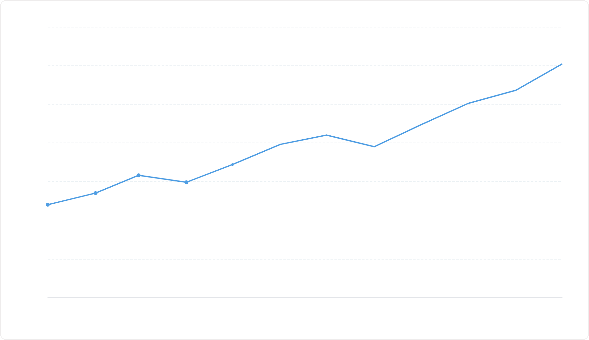

### Valeurs compactes — `14-valeurs-compactes.png`

Valeurs affichées en notation compacte (2,5 k au lieu de 2 510).

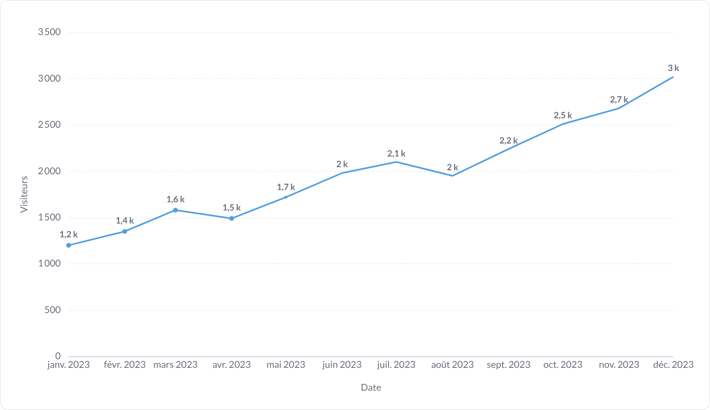
