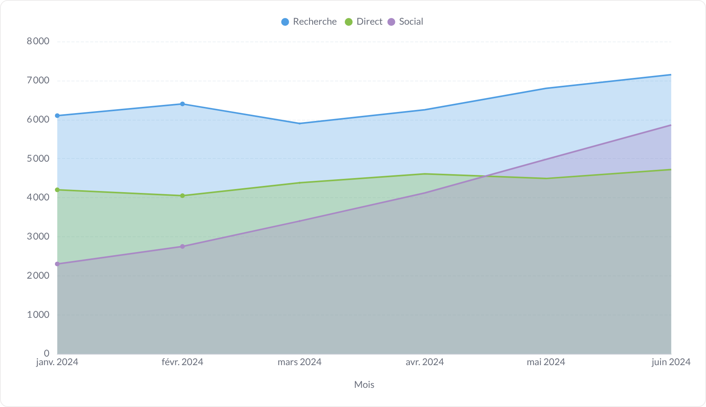
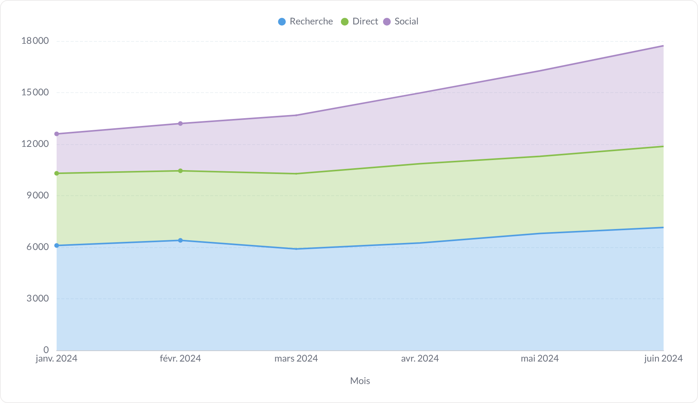
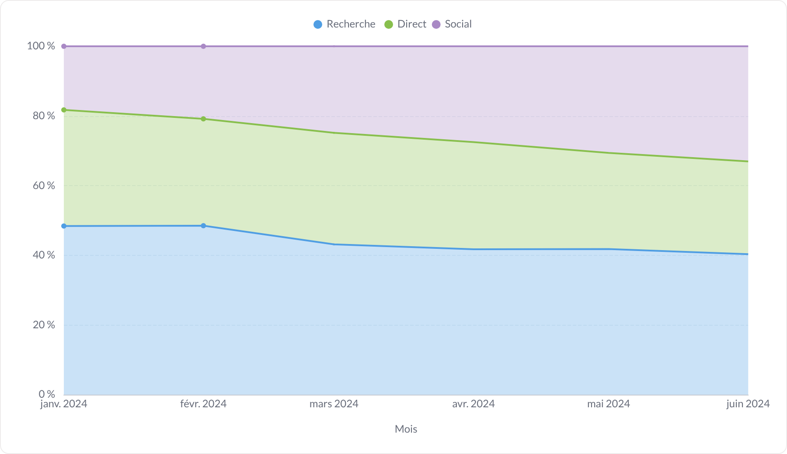
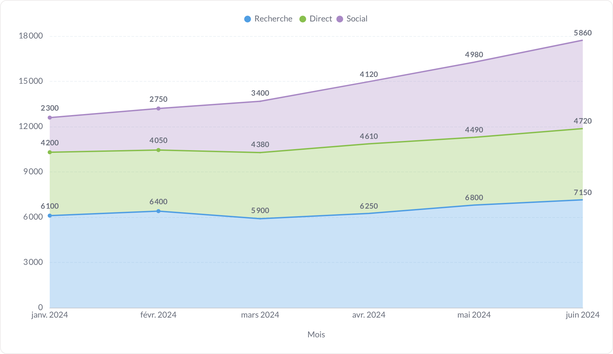
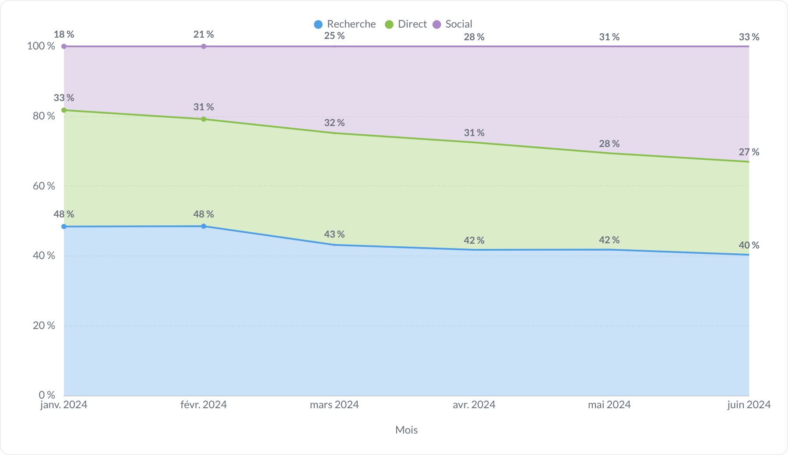
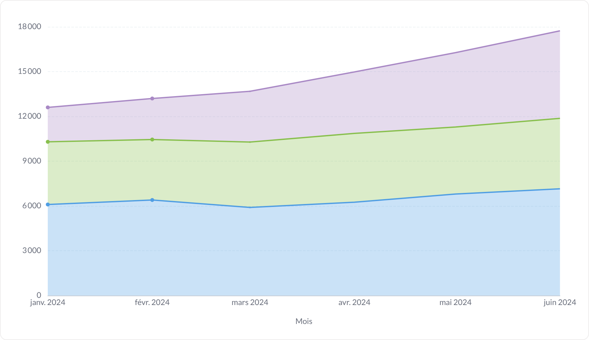
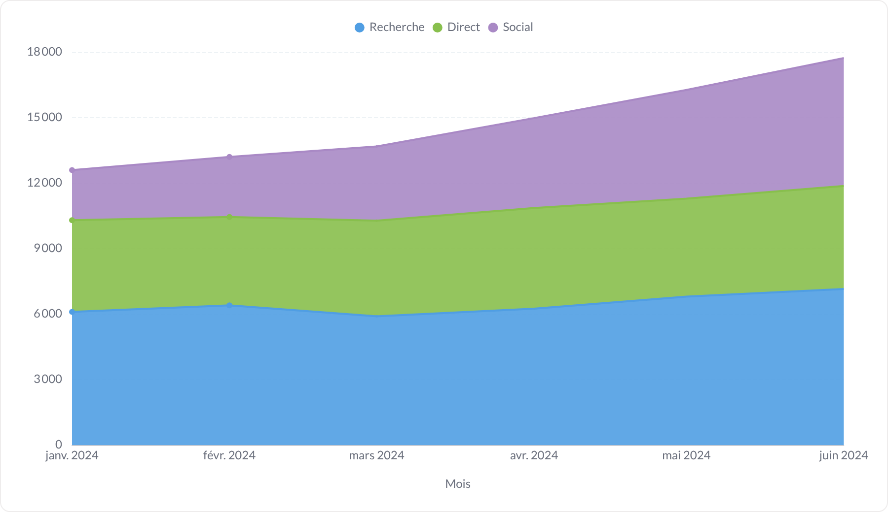
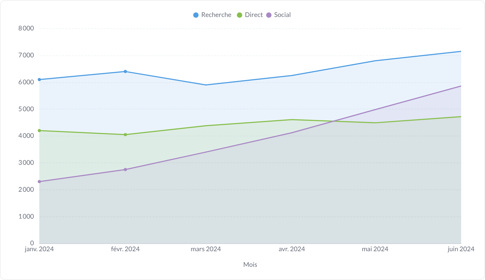
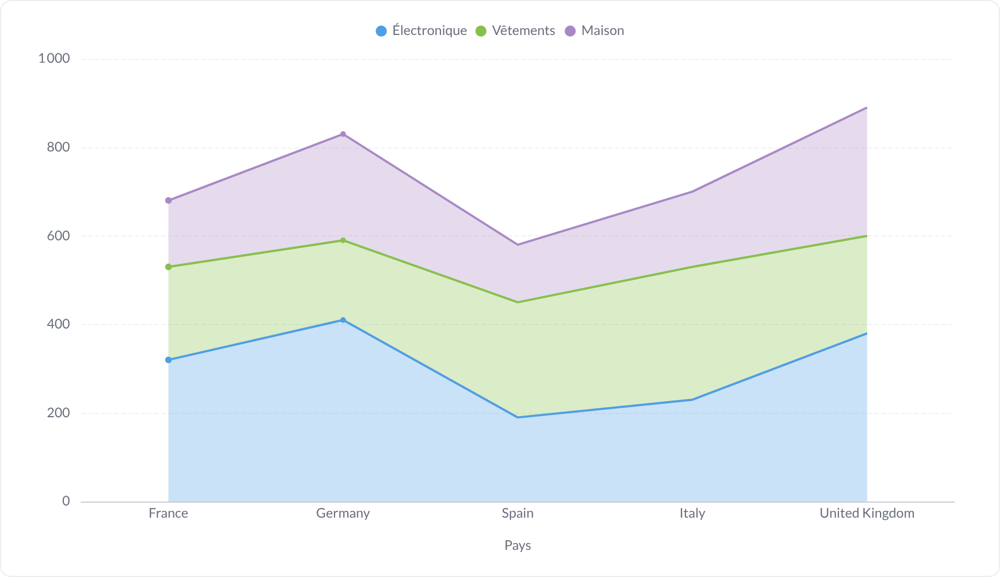

# Aire

L'aire est une courbe remplie : elle sert surtout à montrer une composition dans le temps. C'est là que l'empilement 100 % prend tout son sens.

**Jeu de données :** `Mois, Canal, Sessions` — 6 mois × 3 canaux d'acquisition, éclaté par canal ; la dernière capture utilise `Pays, Catégorie, Ventes`.

| Fichier | Variante | Ce qui change |
| --- | --- | --- |
| `01-defaut.png` | Défaut | Aires superposées (non empilées), remplissage à 30 % d'opacité : les séries se masquent partiellement. |
| `02-empilee.png` | Empilée | Empilement = « Empiler » : les aires s'additionnent, le haut de la pile donne le total des sessions. |
| `03-empilee-100.png` | Empilée 100 % | Empilement = « 100 % » : la surface est pleine et on lit l'évolution des parts — ici le social qui grignote la recherche. |
| `04-empilee-avec-valeurs.png` | Empilée + valeurs | Empilé avec les valeurs écrites dans les bandes. |
| `05-empilee-100-avec-valeurs.png` | Empilée 100 % + valeurs | Même graphique en 100 %, avec le pourcentage dans chaque bande. |
| `06-sans-legende.png` | Sans légende | Empilé, légende masquée. |
| `07-lissee.png` | Lissée | Aires empilées à contour courbé. |
| `08-remplissage-opaque.png` | Remplissage opaque | Opacité = « opaque » : aplats pleins, contraste maximal. |
| `09-remplissage-transparent.png` | Remplissage transparent | Opacité = « transparent » sur des aires non empilées : le remplissage n'est qu'un rappel, le trait domine. |
| `10-axe-categoriel.png` | Axe catégoriel | L'aire ne sert pas qu'au temps : mêmes réglages sur un axe de catégories (ventes par pays, empilées par catégorie de produit). |

---

### Défaut — `01-defaut.png`

Aires superposées (non empilées), remplissage à 30 % d'opacité : les séries se masquent partiellement.

### Empilée — `02-empilee.png`

Empilement = « Empiler » : les aires s'additionnent, le haut de la pile donne le total des sessions.

### Empilée 100 % — `03-empilee-100.png`

Empilement = « 100 % » : la surface est pleine et on lit l'évolution des parts — ici le social qui grignote la recherche.

### Empilée + valeurs — `04-empilee-avec-valeurs.png`

Empilé avec les valeurs écrites dans les bandes.

### Empilée 100 % + valeurs — `05-empilee-100-avec-valeurs.png`

Même graphique en 100 %, avec le pourcentage dans chaque bande.

### Sans légende — `06-sans-legende.png`

Empilé, légende masquée.

### Lissée — `07-lissee.png`

Aires empilées à contour courbé.

### Remplissage opaque — `08-remplissage-opaque.png`

Opacité = « opaque » : aplats pleins, contraste maximal.

### Remplissage transparent — `09-remplissage-transparent.png`

Opacité = « transparent » sur des aires non empilées : le remplissage n'est qu'un rappel, le trait domine.

### Axe catégoriel — `10-axe-categoriel.png`

L'aire ne sert pas qu'au temps : mêmes réglages sur un axe de catégories (ventes par pays, empilées par catégorie de produit).

