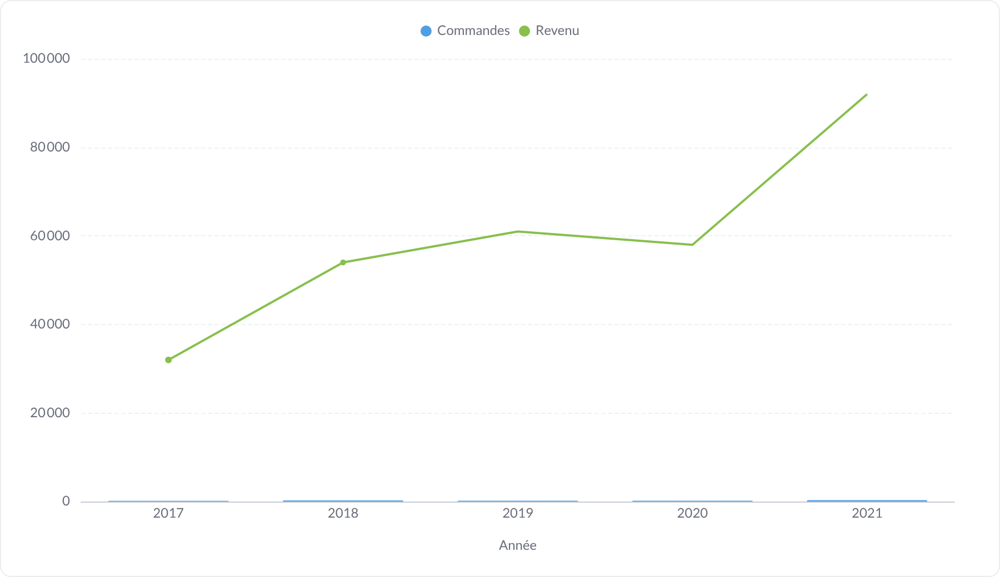
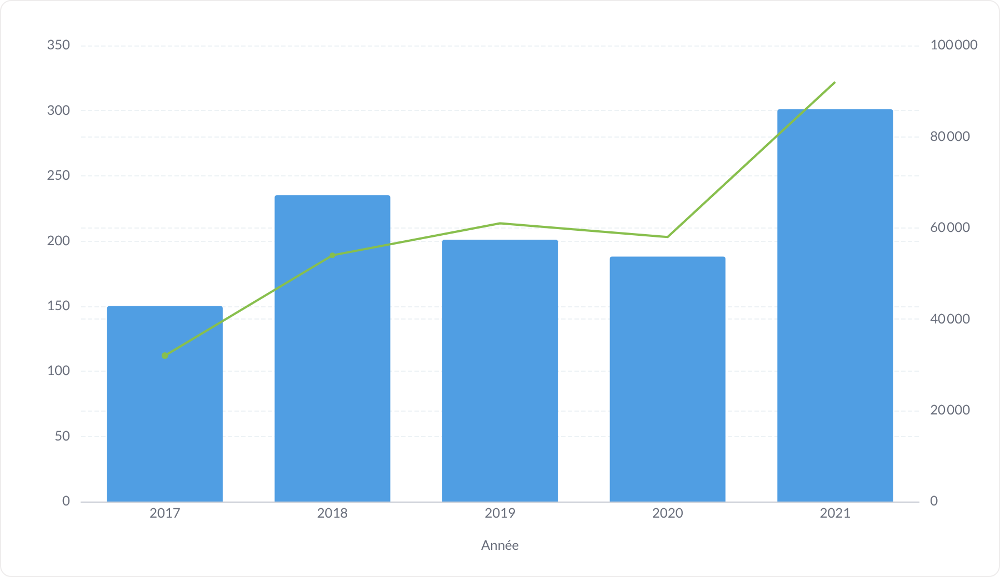
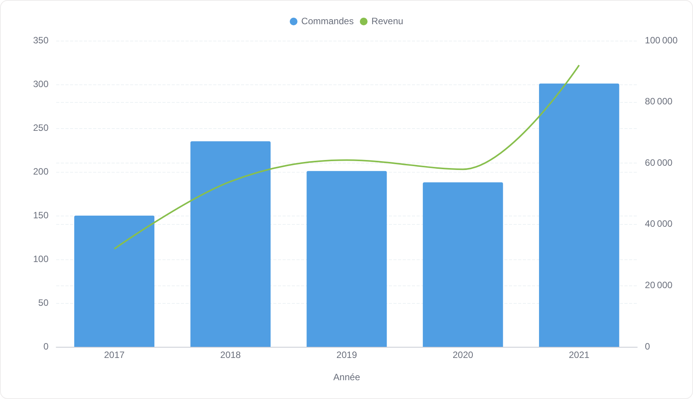
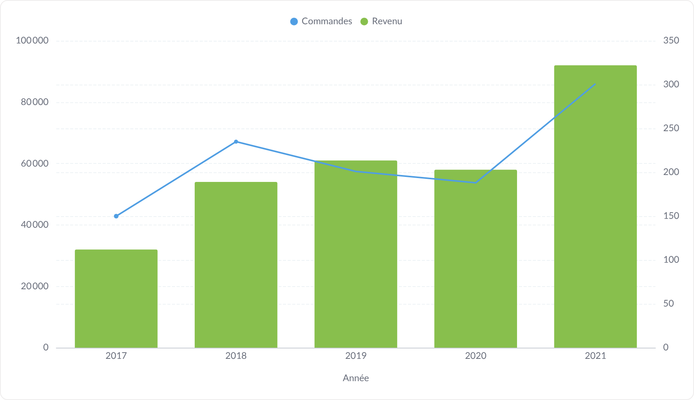
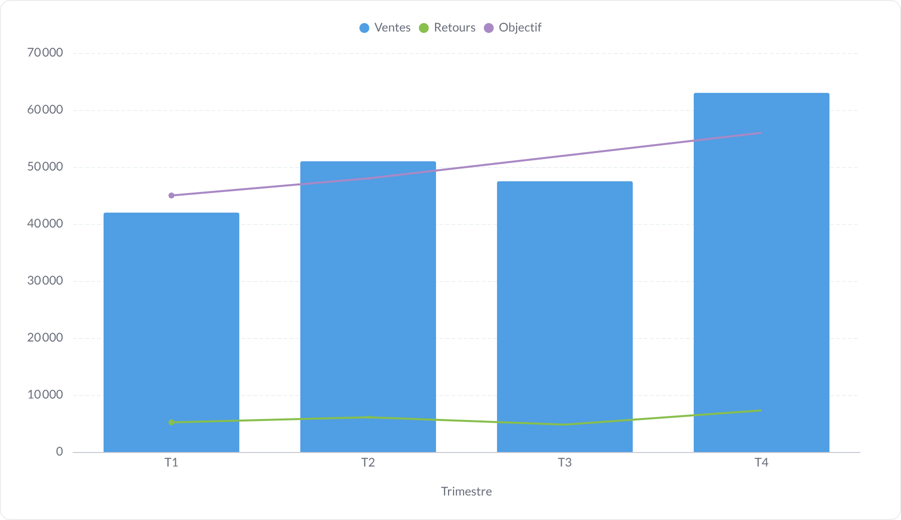
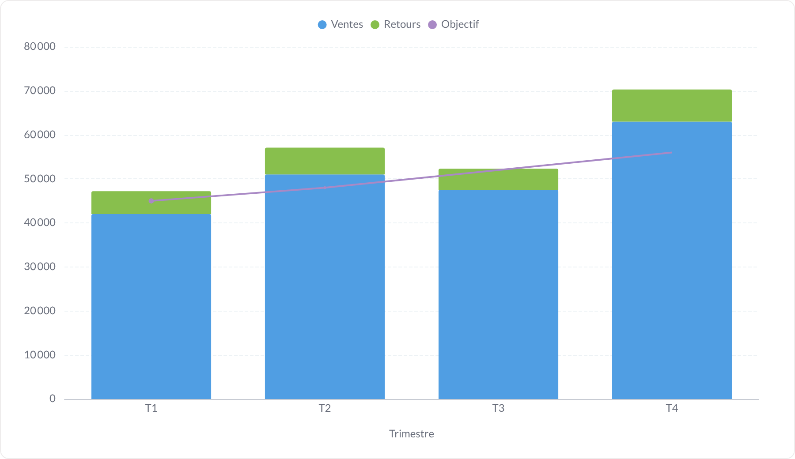
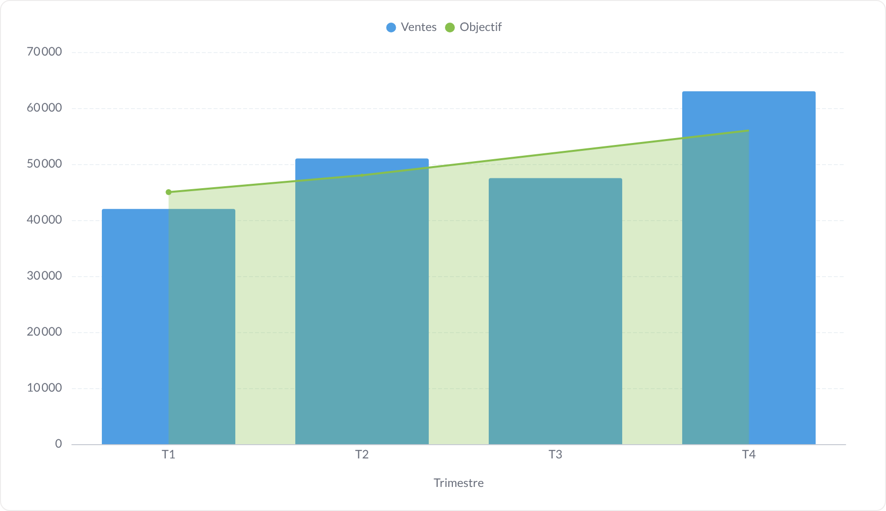

# Combiné (barres + courbe)

Le graphique composé : la première mesure en barres, les suivantes en courbe. C'est le format « réalisé vs objectif » ou « volume vs taux ».

**Jeu de données :** `Année, Commandes, Revenu` (5 ans) et un jeu trimestriel `Ventes, Retours, Objectif`.

| Fichier | Variante | Ce qui change |
| --- | --- | --- |
| `01-defaut.png` | Défaut | 1ʳᵉ mesure en barres, 2ᵉ en courbe, même axe Y — les deux échelles s'écrasent, d'où la variante suivante. |
| `02-deux-axes-y.png` | Deux axes Y | `Revenu` basculé sur l'axe de droite : c'est le réglage à privilégier dès que les ordres de grandeur diffèrent. |
| `03-avec-valeurs.png` | Avec valeurs | Deux axes + valeurs affichées sur les barres et sur les points. |
| `04-sans-legende.png` | Sans légende | Deux axes, légende masquée. |
| `05-courbe-lissee.png` | Courbe lissée | La série en courbe est lissée et ses points masqués : elle se lit comme une tendance. |
| `06-inverse.png` | Rôles inversés | Type d'affichage forcé par série : `Revenu` en barres, `Commandes` en courbe. |
| `07-avec-objectif.png` | Ligne d'objectif | Combiné plus une ligne d'objectif à 250 commandes. |
| `08-trois-mesures.png` | Trois mesures | Trois séries : `Ventes` en barres, `Retours` et `Objectif` en courbes. |
| `09-barres-empilees-plus-courbe.png` | Barres empilées + courbe | Empilement activé : seules les barres s'empilent, la courbe `Objectif` reste posée par-dessus. |
| `10-aire-plus-barres.png` | Aire + barres | Type d'affichage par série poussé plus loin : une aire derrière, des barres devant. |

---

### Défaut — `01-defaut.png`

1ʳᵉ mesure en barres, 2ᵉ en courbe, même axe Y — les deux échelles s'écrasent, d'où la variante suivante.

### Deux axes Y — `02-deux-axes-y.png`

`Revenu` basculé sur l'axe de droite : c'est le réglage à privilégier dès que les ordres de grandeur diffèrent.

### Avec valeurs — `03-avec-valeurs.png`

Deux axes + valeurs affichées sur les barres et sur les points.

### Sans légende — `04-sans-legende.png`

Deux axes, légende masquée.

### Courbe lissée — `05-courbe-lissee.png`

La série en courbe est lissée et ses points masqués : elle se lit comme une tendance.

### Rôles inversés — `06-inverse.png`

Type d'affichage forcé par série : `Revenu` en barres, `Commandes` en courbe.

### Ligne d'objectif — `07-avec-objectif.png`

Combiné plus une ligne d'objectif à 250 commandes.

### Trois mesures — `08-trois-mesures.png`

Trois séries : `Ventes` en barres, `Retours` et `Objectif` en courbes.

### Barres empilées + courbe — `09-barres-empilees-plus-courbe.png`

Empilement activé : seules les barres s'empilent, la courbe `Objectif` reste posée par-dessus.

### Aire + barres — `10-aire-plus-barres.png`

Type d'affichage par série poussé plus loin : une aire derrière, des barres devant.

