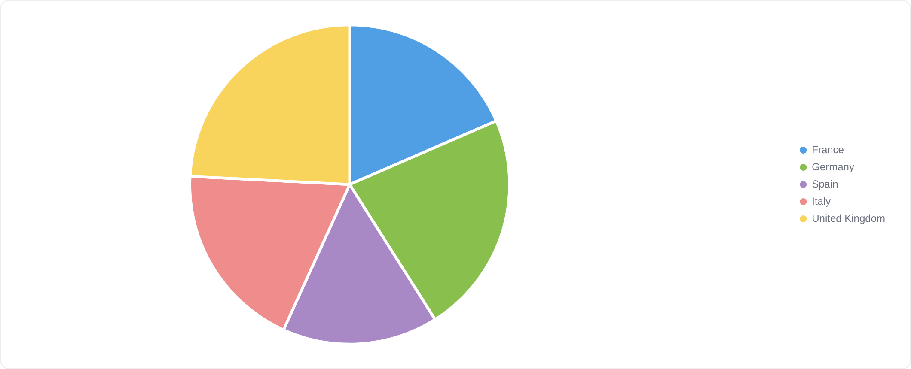
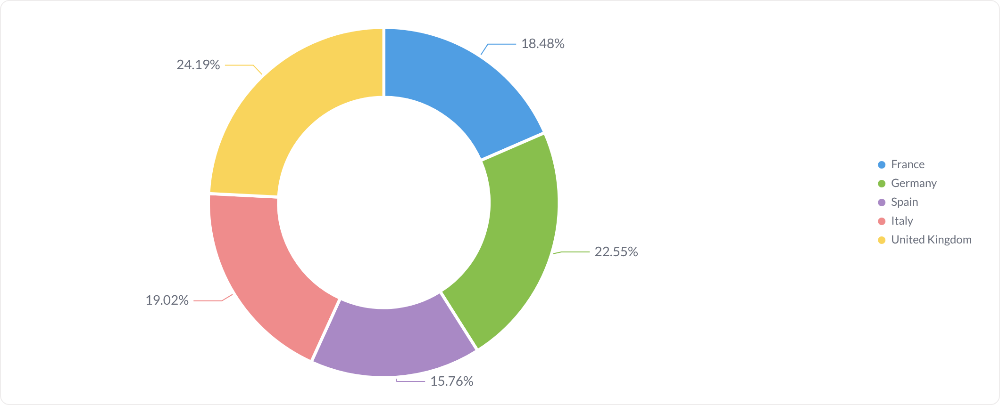
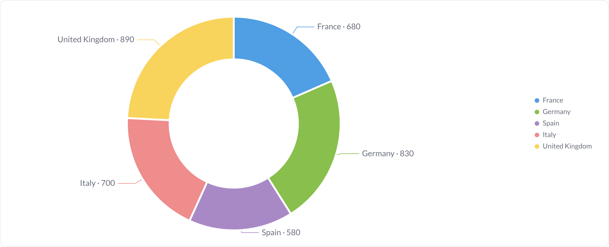
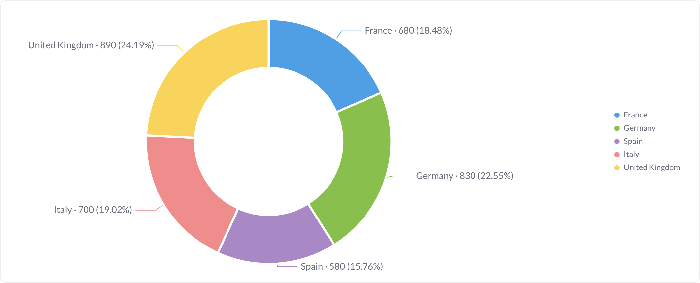
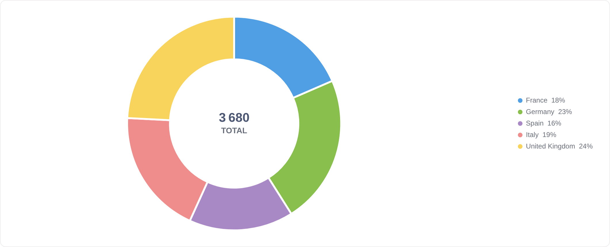
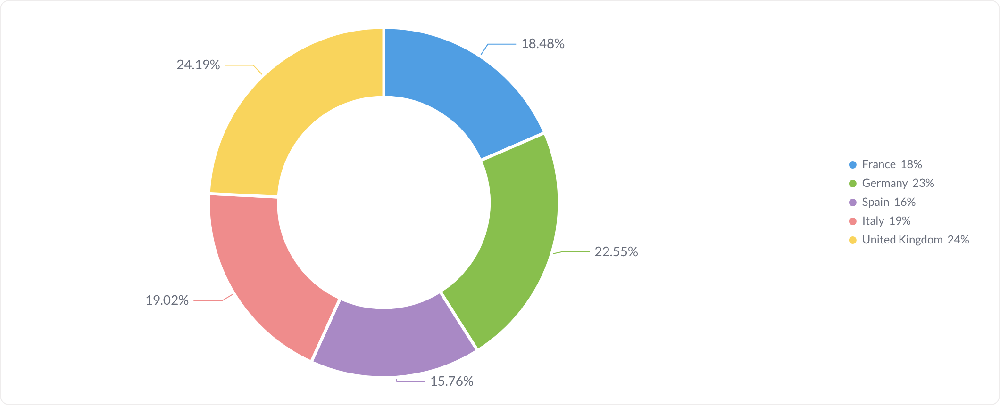
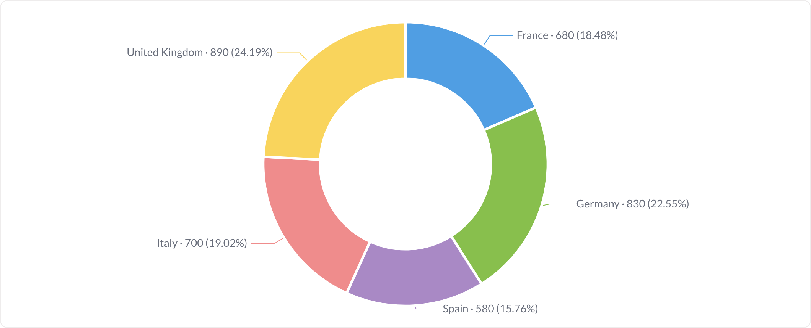
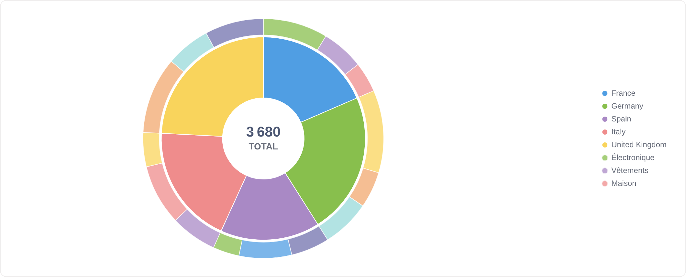
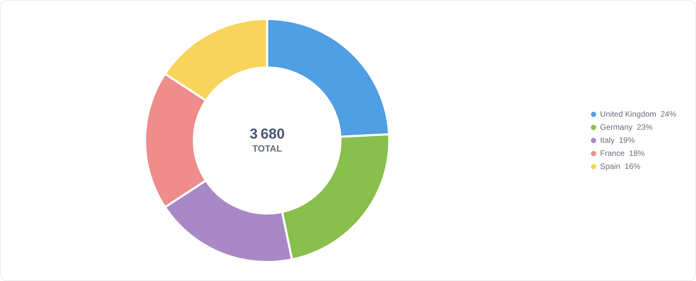

# Camembert

Le camembert et sa version anneau (donut). Ici tout se joue sur les étiquettes : pourcentage, valeur absolue, les deux, dans la légende, ou rien du tout.

**Jeu de données :** `Pays, Catégorie, Ventes` — somme des ventes par pays (5 parts).

| Fichier | Variante | Ce qui change |
| --- | --- | --- |
| `01-anneau-defaut.png` | Anneau (défaut) | Réglages par défaut : anneau, total au centre, légende à droite, aucune étiquette sur les parts. |
| `02-camembert-plein.png` | Camembert plein | « Anneau (donut) » désactivé : disque plein, donc plus de total au centre. |
| `03-pourcentages-sur-le-graphique.png` | Pourcentages sur le graphique | Pourcentages = « Sur le graphique » : chaque part porte sa part du total. |
| `04-etiquettes-nom-et-pourcentage.png` | Nom + pourcentage | Affichage des étiquettes = « Visible », format = pourcentage : le nom de la part et sa part sont écrits en dehors du disque. |
| `05-etiquettes-valeurs-absolues.png` | Valeurs absolues | Format des valeurs = « Valeur » : on lit les ventes en unités, pas en parts. |
| `06-etiquettes-valeur-et-pourcentage.png` | Valeur + pourcentage | Format des valeurs = « Valeur + % » : les deux lectures d'un coup. |
| `07-pourcentages-dans-la-legende.png` | Pourcentages dans la légende | Pourcentages = « Dans la légende » : le disque reste net, les chiffres passent à droite. |
| `08-pourcentages-partout.png` | Pourcentages partout | Pourcentages = « Les deux » : sur les parts et dans la légende. |
| `09-sans-etiquettes.png` | Sans étiquettes | Affichage des étiquettes = « Masqué » : ni pourcentage, ni total central — la lecture passe uniquement par la légende. |
| `10-sans-legende.png` | Sans légende | Légende masquée : l'anneau se recentre et les étiquettes portent les noms. |
| `11-sans-total-au-centre.png` | Sans total au centre | « Afficher le total au centre » désactivé : l'anneau garde son trou, mais vide. |
| `12-deux-anneaux.png` | Deux anneaux | Anneau intérieur = `Pays`, anneau extérieur = `Catégorie` : la décomposition à deux niveaux. |
| `13-trie-par-valeur.png` | Trié par valeur | Tri par valeur décroissante : les parts partent de la plus grosse. |

---

### Anneau (défaut) — `01-anneau-defaut.png`

Réglages par défaut : anneau, total au centre, légende à droite, aucune étiquette sur les parts.

### Camembert plein — `02-camembert-plein.png`

« Anneau (donut) » désactivé : disque plein, donc plus de total au centre.

### Pourcentages sur le graphique — `03-pourcentages-sur-le-graphique.png`

Pourcentages = « Sur le graphique » : chaque part porte sa part du total.

### Nom + pourcentage — `04-etiquettes-nom-et-pourcentage.png`

Affichage des étiquettes = « Visible », format = pourcentage : le nom de la part et sa part sont écrits en dehors du disque.

### Valeurs absolues — `05-etiquettes-valeurs-absolues.png`

Format des valeurs = « Valeur » : on lit les ventes en unités, pas en parts.

### Valeur + pourcentage — `06-etiquettes-valeur-et-pourcentage.png`

Format des valeurs = « Valeur + % » : les deux lectures d'un coup.

### Pourcentages dans la légende — `07-pourcentages-dans-la-legende.png`

Pourcentages = « Dans la légende » : le disque reste net, les chiffres passent à droite.

### Pourcentages partout — `08-pourcentages-partout.png`

Pourcentages = « Les deux » : sur les parts et dans la légende.

### Sans étiquettes — `09-sans-etiquettes.png`

Affichage des étiquettes = « Masqué » : ni pourcentage, ni total central — la lecture passe uniquement par la légende.

### Sans légende — `10-sans-legende.png`

Légende masquée : l'anneau se recentre et les étiquettes portent les noms.

### Sans total au centre — `11-sans-total-au-centre.png`

« Afficher le total au centre » désactivé : l'anneau garde son trou, mais vide.

### Deux anneaux — `12-deux-anneaux.png`

Anneau intérieur = `Pays`, anneau extérieur = `Catégorie` : la décomposition à deux niveaux.

### Trié par valeur — `13-trie-par-valeur.png`

Tri par valeur décroissante : les parts partent de la plus grosse.

