# Nombre (chiffre clé)

Le « Nombre » n'affiche qu'une valeur : tout se joue dans sa mise en forme (devise, pourcentage, décimales, préfixe/suffixe, couleur conditionnelle).

**Jeu de données :** `Année, Commandes, Revenu` résumé en une somme, sauf le pourcentage (un taux de conversion).

| Fichier | Variante | Ce qui change |
| --- | --- | --- |
| `01-defaut.png` | Défaut | Somme du revenu, format par défaut : séparateur de milliers français, libellé de la mesure en dessous. |
| `02-format-devise.png` | Devise | Style = « Devise », symbole € affiché avec la valeur. |
| `03-devise-en-code.png` | Devise en code | Même chose avec le code ISO (EUR) au lieu du symbole. |
| `04-pourcentage.png` | Pourcentage | Style = « Pourcentage » sur un taux stocké en 0,0911 → affiché 9,11 %. |
| `05-deux-decimales.png` | Deux décimales | « Nombre de décimales » = 2 : le chiffre est figé au centime près. |
| `06-prefixe-suffixe.png` | Préfixe / suffixe | Préfixe « ≈ » et suffixe « € HT » ajoutés autour de la valeur. |
| `07-multiplie-par.png` | Multiplié par | « Multiplier par » 0,001 et suffixe « k€ » : la même donnée exprimée en milliers. |
| `08-separateur-anglo-saxon.png` | Séparateur anglo-saxon | Style de séparateur = 100,000.00 au lieu de 100 000,00. |
| `09-notation-scientifique.png` | Notation scientifique | Style = « Scientifique » : 2,97e+5. |
| `10-couleur-conditionnelle.png` | Couleur conditionnelle | Règle « > 200 000 → vert » : le chiffre change de couleur quand le seuil est franchi. |
| `11-couleur-conditionnelle-alerte.png` | Couleur conditionnelle (alerte) | Même règle, seuil relevé à 500 000 : la valeur passe sous le seuil et vire au rouge. |

---

### Défaut — `01-defaut.png`

Somme du revenu, format par défaut : séparateur de milliers français, libellé de la mesure en dessous.

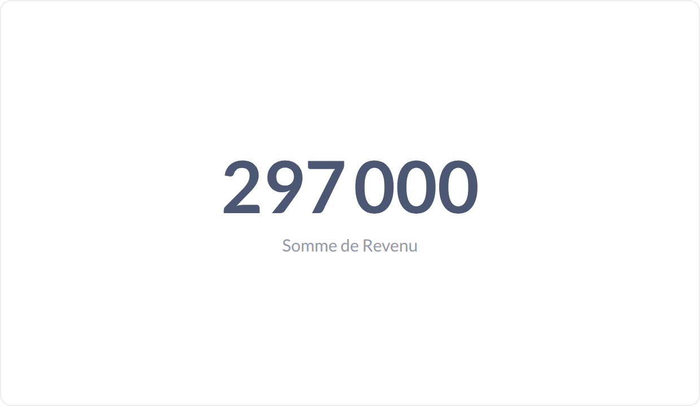

### Devise — `02-format-devise.png`

Style = « Devise », symbole € affiché avec la valeur.

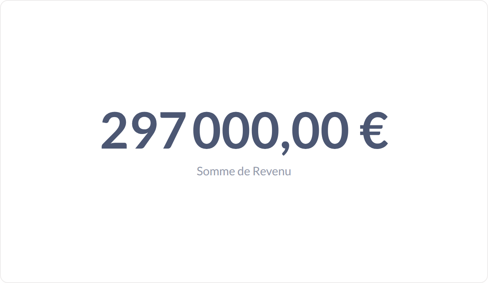

### Devise en code — `03-devise-en-code.png`

Même chose avec le code ISO (EUR) au lieu du symbole.

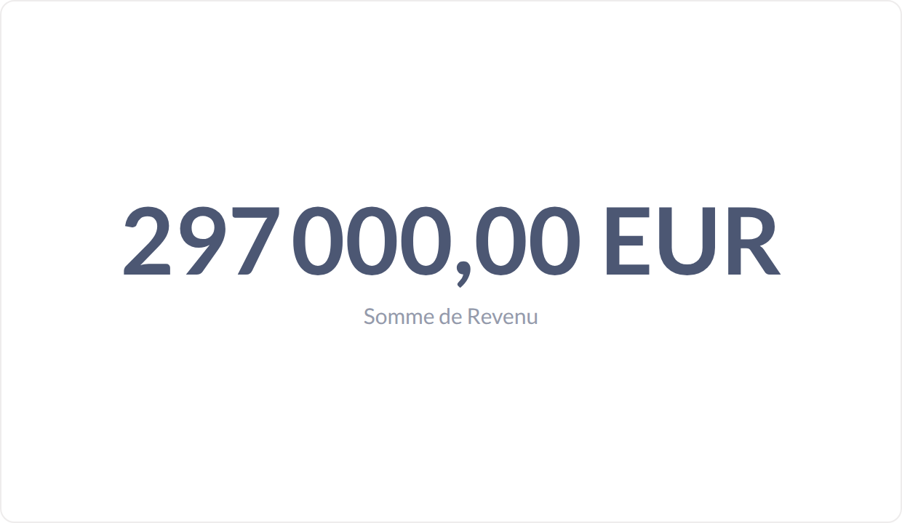

### Pourcentage — `04-pourcentage.png`

Style = « Pourcentage » sur un taux stocké en 0,0911 → affiché 9,11 %.

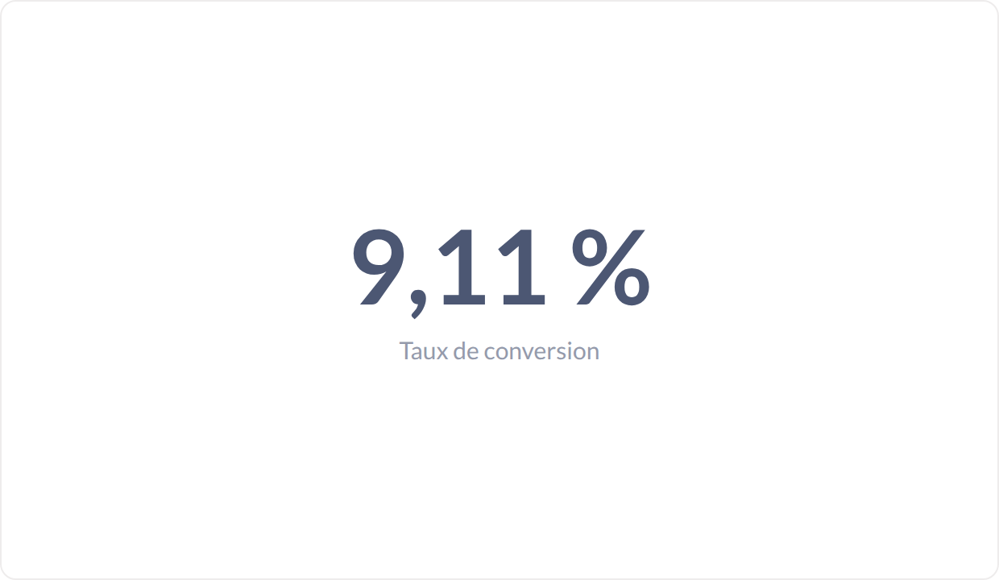

### Deux décimales — `05-deux-decimales.png`

« Nombre de décimales » = 2 : le chiffre est figé au centime près.

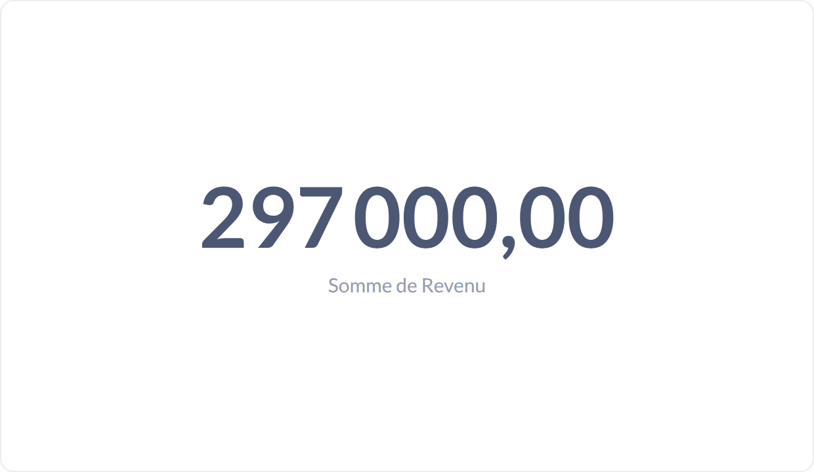

### Préfixe / suffixe — `06-prefixe-suffixe.png`

Préfixe « ≈ » et suffixe « € HT » ajoutés autour de la valeur.

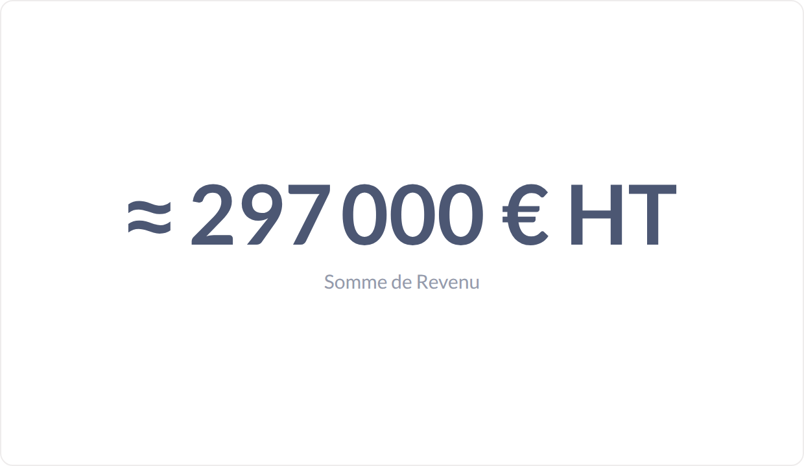

### Multiplié par — `07-multiplie-par.png`

« Multiplier par » 0,001 et suffixe « k€ » : la même donnée exprimée en milliers.

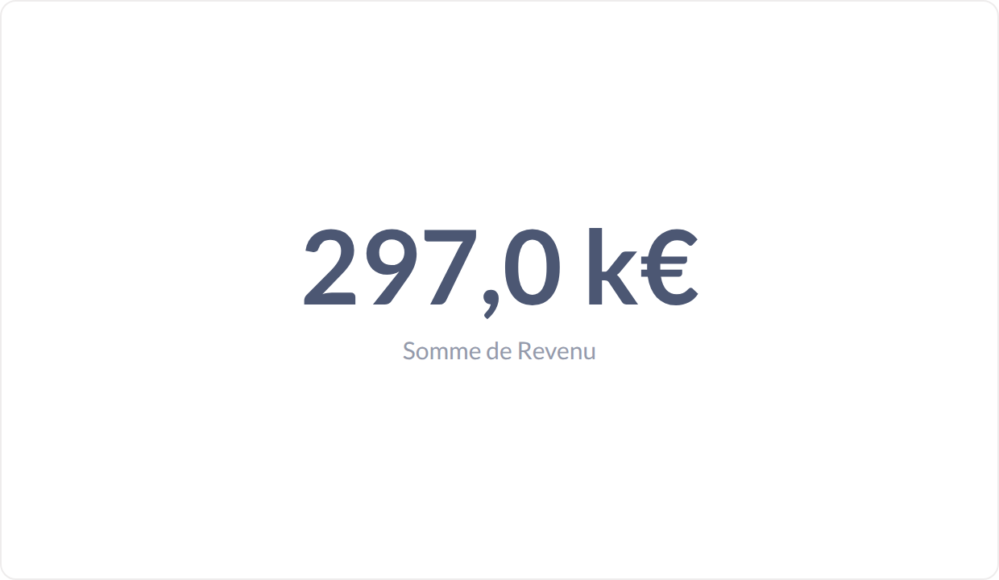

### Séparateur anglo-saxon — `08-separateur-anglo-saxon.png`

Style de séparateur = 100,000.00 au lieu de 100 000,00.

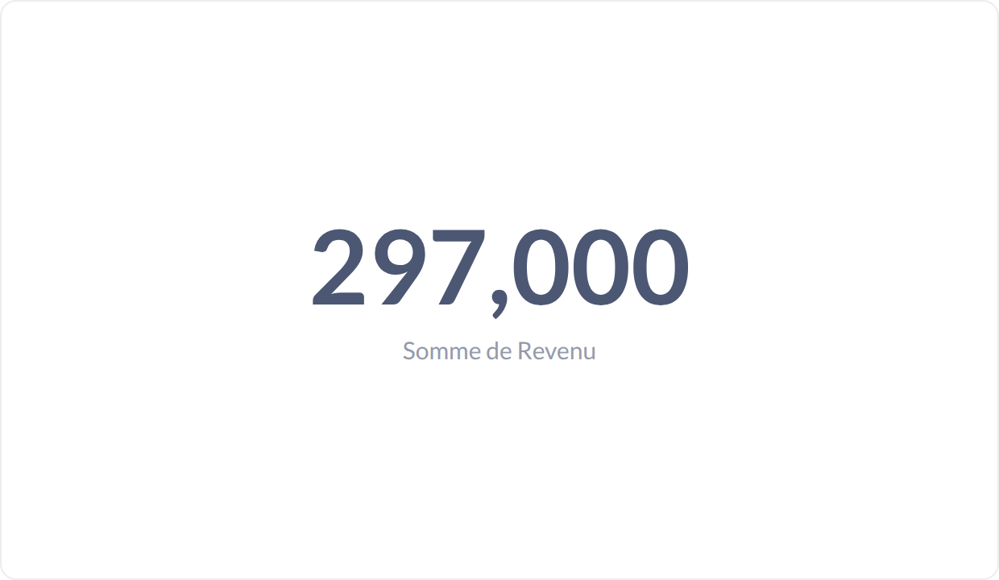

### Notation scientifique — `09-notation-scientifique.png`

Style = « Scientifique » : 2,97e+5.

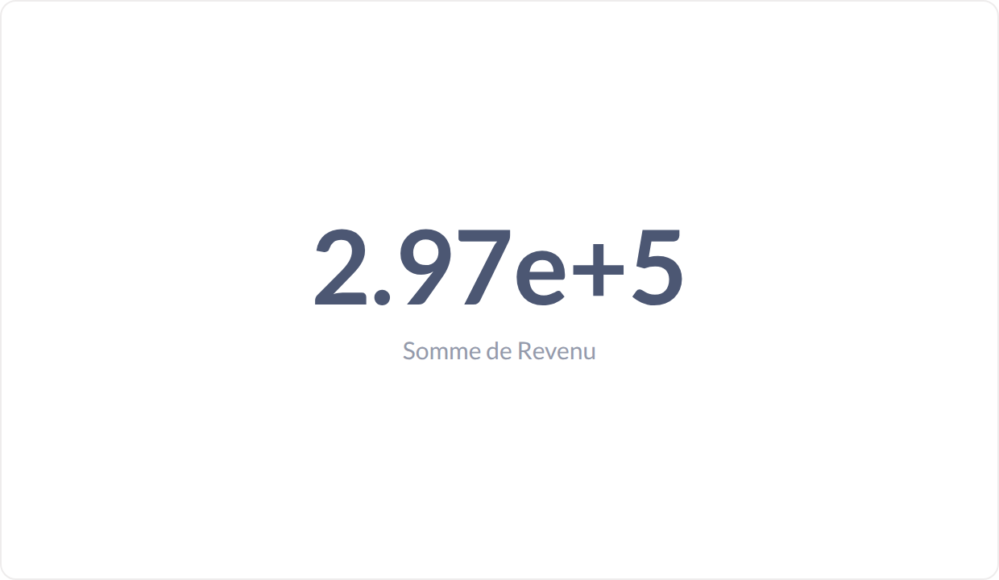

### Couleur conditionnelle — `10-couleur-conditionnelle.png`

Règle « > 200 000 → vert » : le chiffre change de couleur quand le seuil est franchi.

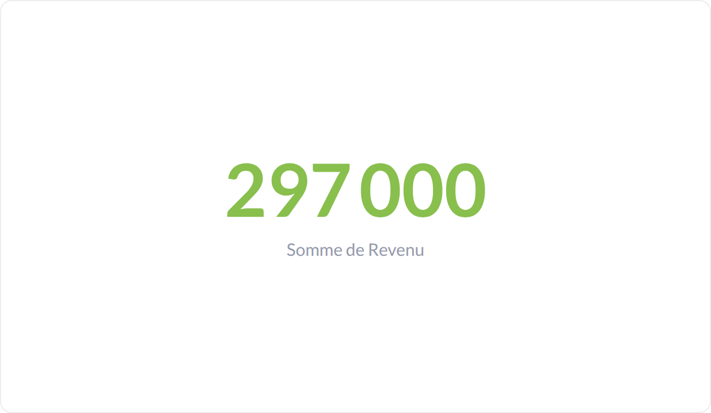

### Couleur conditionnelle (alerte) — `11-couleur-conditionnelle-alerte.png`

Même règle, seuil relevé à 500 000 : la valeur passe sous le seuil et vire au rouge.

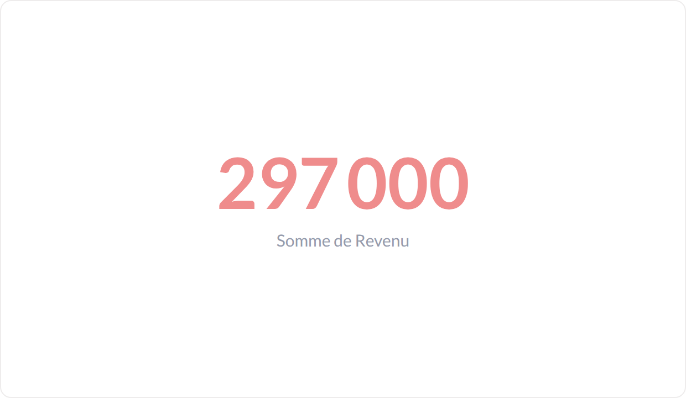
