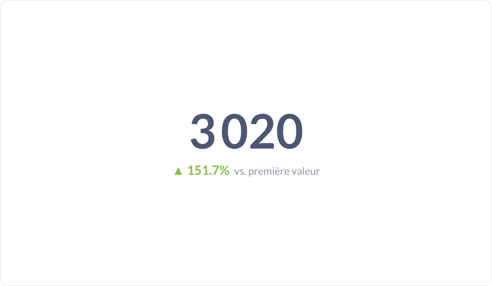
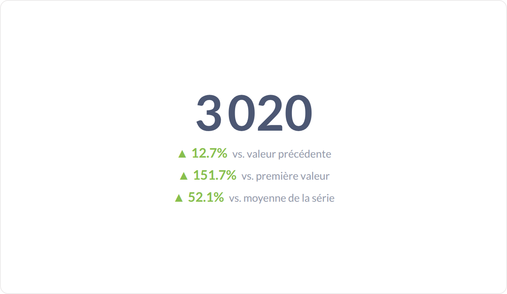
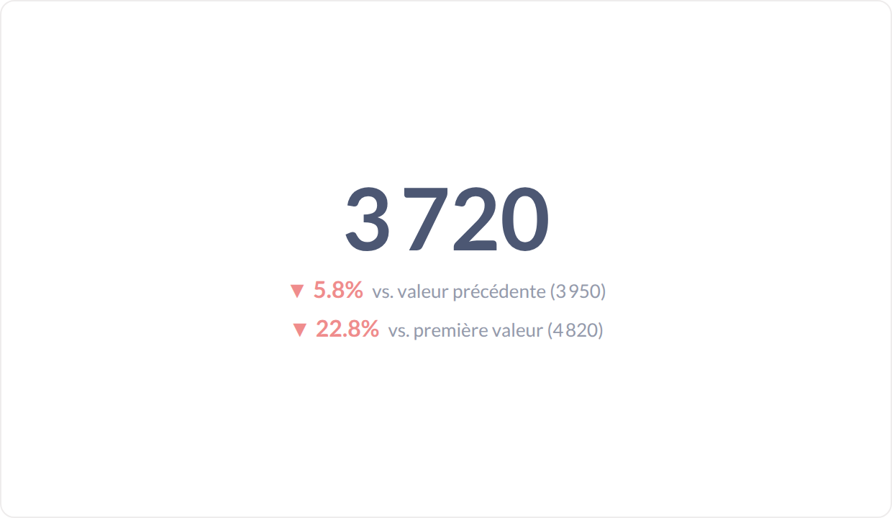
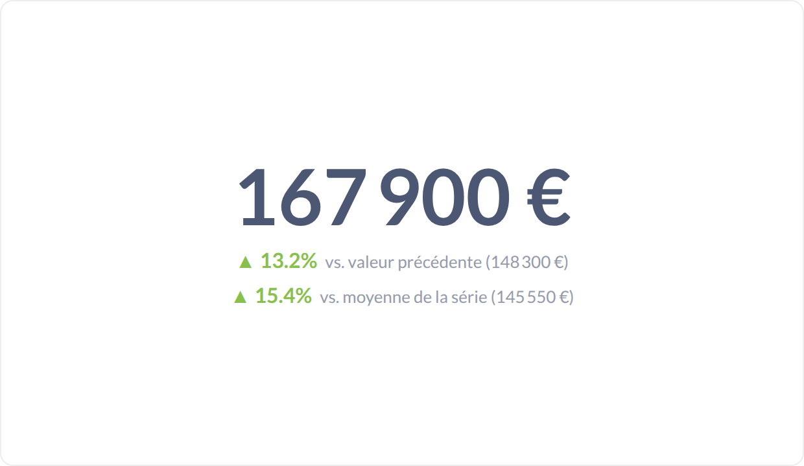

# Tendance (smart scalar)

La dernière valeur d'une série, comparée à quelque chose : la valeur précédente, la première, la moyenne — ou les trois à la fois.

**Jeu de données :** `Date, Visiteurs, Conversions` (12 mois), plus deux séries dédiées : abonnés en baisse et revenus mensuels.

| Fichier | Variante | Ce qui change |
| --- | --- | --- |
| `01-defaut.png` | Défaut | Dernière valeur et écart en % vs la valeur précédente, flèche verte car en hausse. |
| `02-vs-premiere-valeur.png` | vs première valeur | Comparaison = « première valeur » : l'écart depuis le début de la série. |
| `03-vs-moyenne.png` | vs moyenne | Comparaison = « moyenne de la série ». |
| `04-trois-comparaisons.png` | Trois comparaisons | Les trois comparaisons empilées sous le chiffre. |
| `05-avec-valeur-de-comparaison.png` | Avec valeur de référence | « Afficher la valeur de comparaison » : la base du calcul est rappelée entre parenthèses. |
| `06-tendance-a-la-baisse.png` | Tendance à la baisse | Série décroissante : flèche rouge vers le bas. |
| `07-format-devise.png` | Format devise | Même viz avec un format monétaire appliqué au chiffre et à la valeur de référence. |

---

### Défaut — `01-defaut.png`

Dernière valeur et écart en % vs la valeur précédente, flèche verte car en hausse.

### vs première valeur — `02-vs-premiere-valeur.png`

Comparaison = « première valeur » : l'écart depuis le début de la série.

### vs moyenne — `03-vs-moyenne.png`

Comparaison = « moyenne de la série ».

### Trois comparaisons — `04-trois-comparaisons.png`

Les trois comparaisons empilées sous le chiffre.

### Avec valeur de référence — `05-avec-valeur-de-comparaison.png`

« Afficher la valeur de comparaison » : la base du calcul est rappelée entre parenthèses.

### Tendance à la baisse — `06-tendance-a-la-baisse.png`

Série décroissante : flèche rouge vers le bas.

### Format devise — `07-format-devise.png`

Même viz avec un format monétaire appliqué au chiffre et à la valeur de référence.

