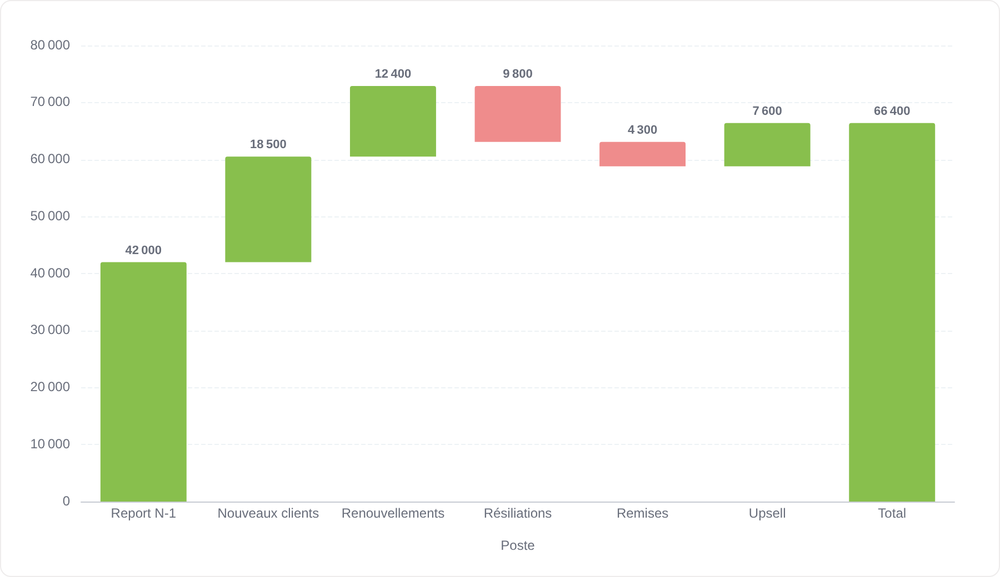
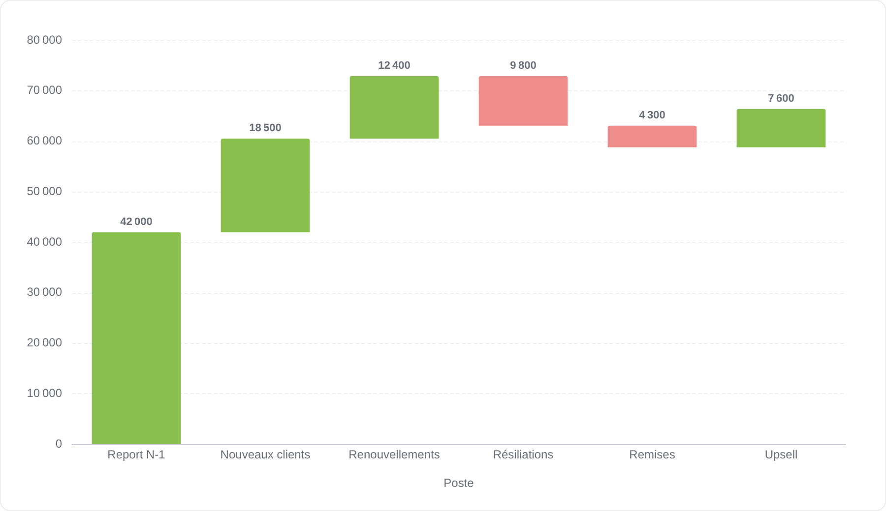
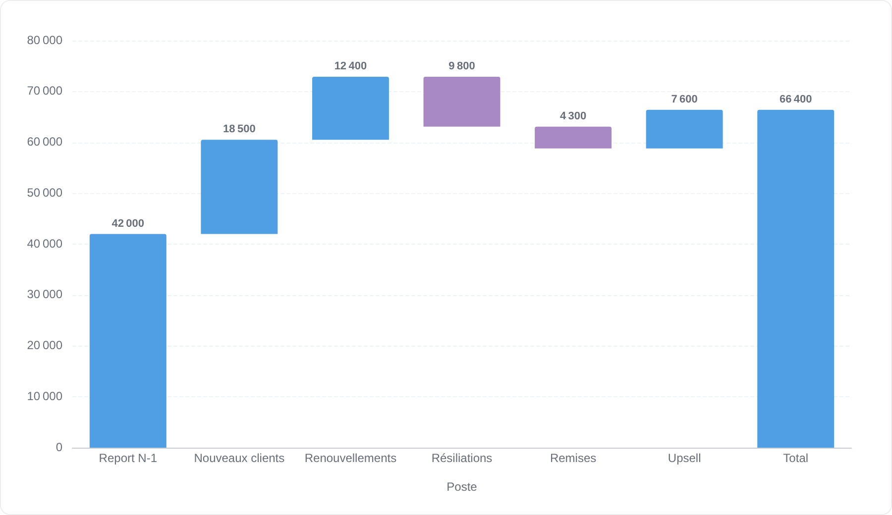
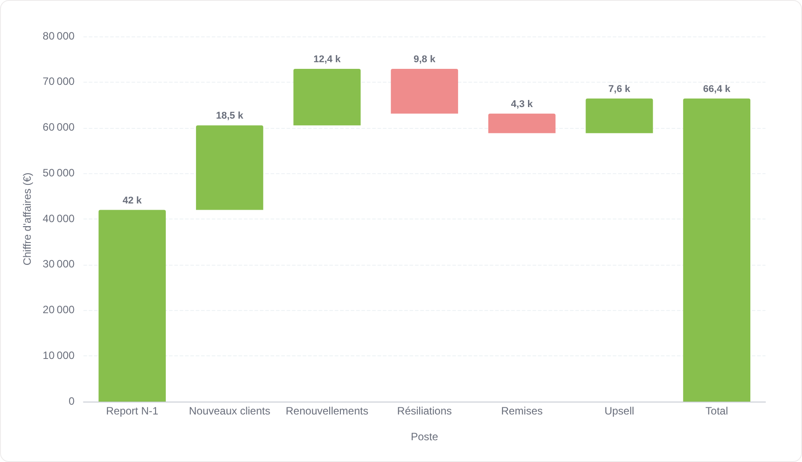

# Cascade (waterfall)

La cascade décompose un écart : chaque barre part de là où la précédente s'est arrêtée, en vert si elle ajoute, en rouge si elle retire.

**Jeu de données :** `Poste, Montant` — un pont de chiffre d'affaires avec des postes positifs et négatifs.

| Fichier | Variante | Ce qui change |
| --- | --- | --- |
| `01-defaut.png` | Défaut | Colonne de total finale incluse, couleurs par défaut. |
| `02-avec-valeurs.png` | Avec valeurs | Montant de chaque marche écrit au-dessus de la barre. |
| `03-sans-colonne-total.png` | Sans colonne de total | « Afficher la colonne de total » désactivé : il ne reste que les mouvements. |
| `04-couleurs-personnalisees.png` | Couleurs personnalisées | Couleurs « Augmentation » / « Diminution » remplacées par le bleu et le violet de la palette. |
| `05-valeurs-compactes.png` | Valeurs compactes | Étiquettes en notation compacte et titres d'axes personnalisés. |

---

### Défaut — `01-defaut.png`

Colonne de total finale incluse, couleurs par défaut.

### Avec valeurs — `02-avec-valeurs.png`

Montant de chaque marche écrit au-dessus de la barre.

### Sans colonne de total — `03-sans-colonne-total.png`

« Afficher la colonne de total » désactivé : il ne reste que les mouvements.

### Couleurs personnalisées — `04-couleurs-personnalisees.png`

Couleurs « Augmentation » / « Diminution » remplacées par le bleu et le violet de la palette.

### Valeurs compactes — `05-valeurs-compactes.png`

Étiquettes en notation compacte et titres d'axes personnalisés.

