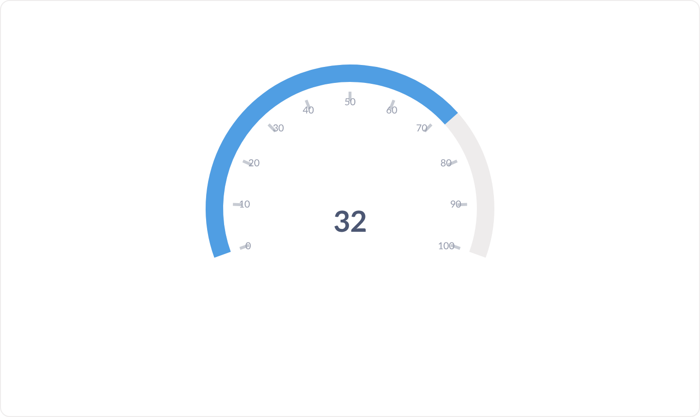
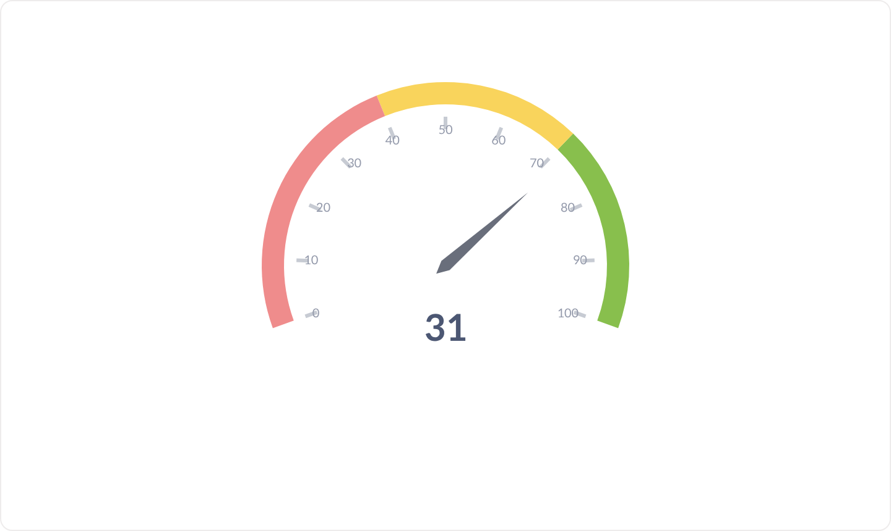
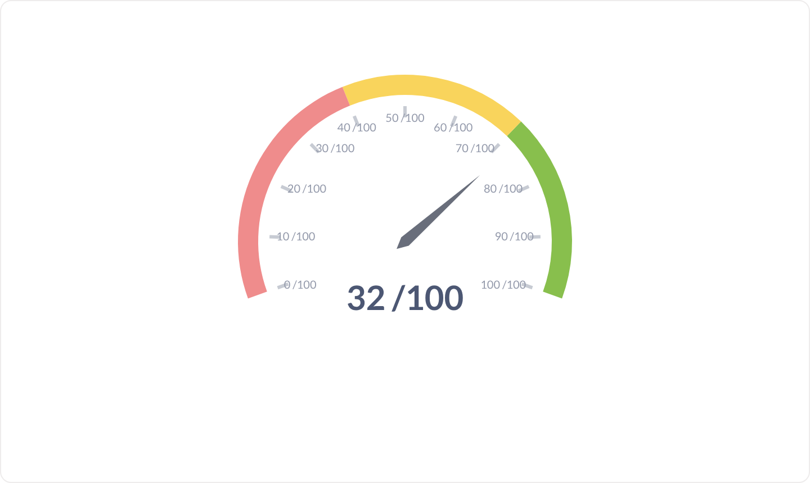

# Jauge

Une valeur unique replacée sur une échelle : soit un simple arc de progression vers un objectif, soit des plages colorées avec aiguille.

**Jeu de données :** `Indicateur, Satisfaction` — une seule ligne.

| Fichier | Variante | Ce qui change |
| --- | --- | --- |
| `01-defaut.png` | Défaut | Arc de progression bleu jusqu'à l'objectif (100). |
| `02-avec-plages-colorees.png` | Plages colorées | Trois plages (rouge / jaune / vert) et une aiguille, comme un feu tricolore. |
| `03-avec-suffixe.png` | Avec suffixe | Mise en forme du nombre : suffixe « /100 » ajouté sous l'aiguille. |

---

### Défaut — `01-defaut.png`

Arc de progression bleu jusqu'à l'objectif (100).

### Plages colorées — `02-avec-plages-colorees.png`

Trois plages (rouge / jaune / vert) et une aiguille, comme un feu tricolore.

### Avec suffixe — `03-avec-suffixe.png`

Mise en forme du nombre : suffixe « /100 » ajouté sous l'aiguille.

