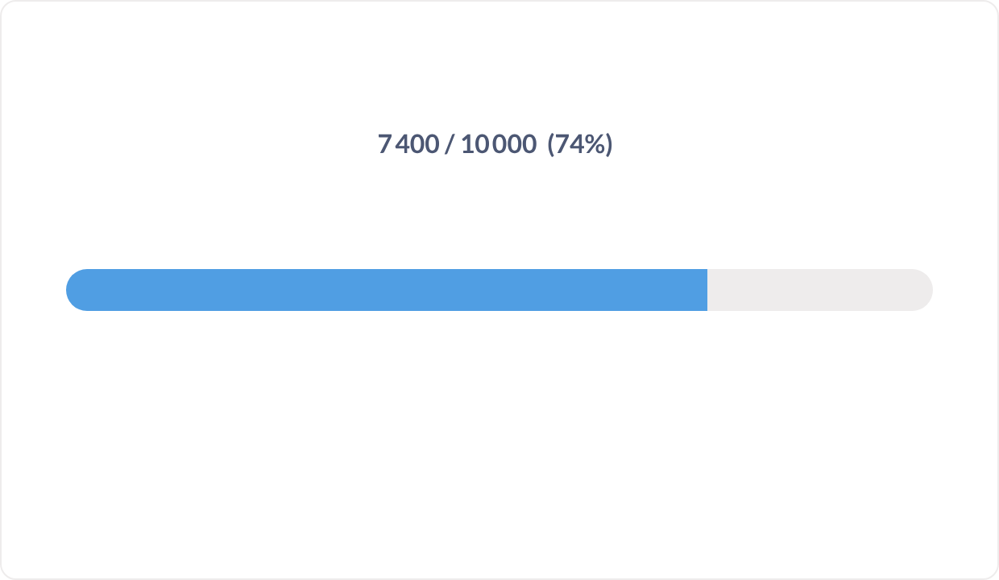
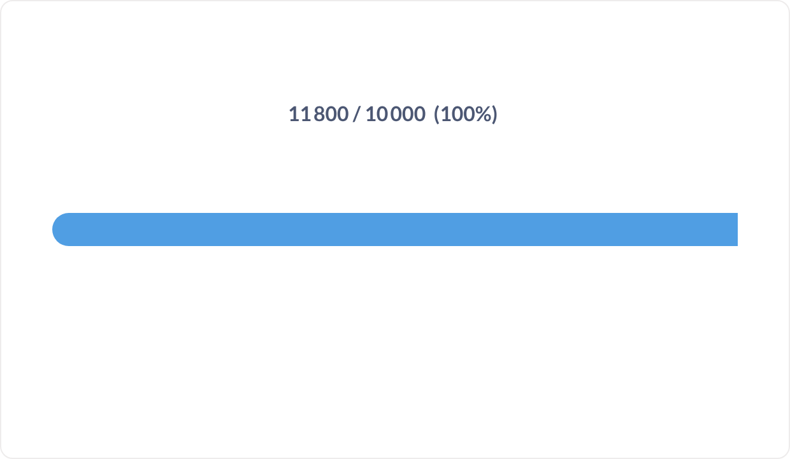
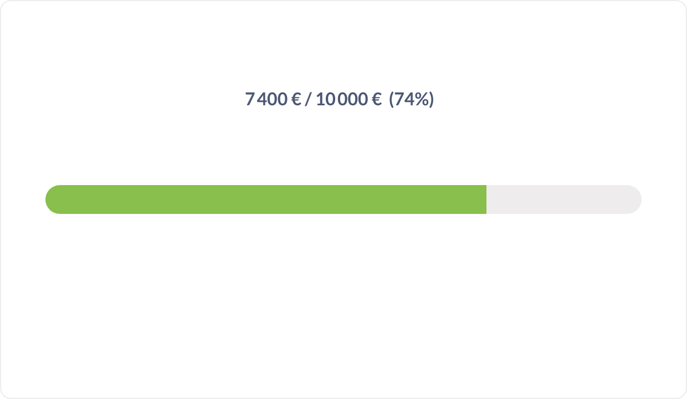

# Progression

Une barre valeur / objectif avec le pourcentage d'atteinte écrit au-dessus.

**Jeu de données :** `Indicateur, Ventes` — une seule ligne.

| Fichier | Variante | Ce qui change |
| --- | --- | --- |
| `01-defaut.png` | Défaut | 7 400 sur un objectif de 10 000 : la barre est remplie à 74 %. |
| `02-objectif-depasse.png` | Objectif dépassé | Valeur au-delà de l'objectif : la barre est pleine et le pourcentage plafonne à 100 %. |
| `03-couleur-et-devise.png` | Couleur + devise | Couleur de la barre changée et valeurs formatées en euros. |

---

### Défaut — `01-defaut.png`

7 400 sur un objectif de 10 000 : la barre est remplie à 74 %.

### Objectif dépassé — `02-objectif-depasse.png`

Valeur au-delà de l'objectif : la barre est pleine et le pourcentage plafonne à 100 %.

### Couleur + devise — `03-couleur-et-devise.png`

Couleur de la barre changée et valeurs formatées en euros.

