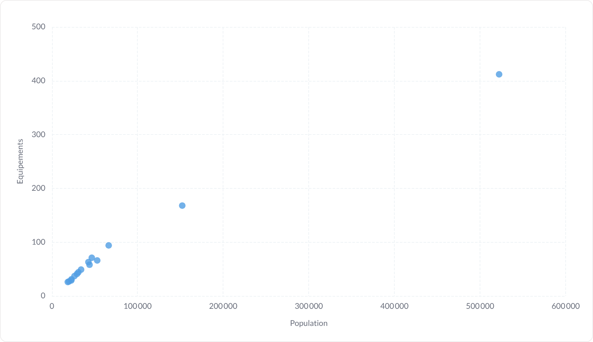
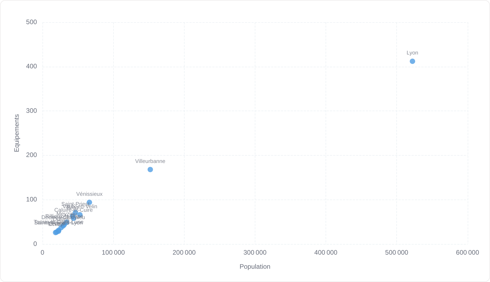
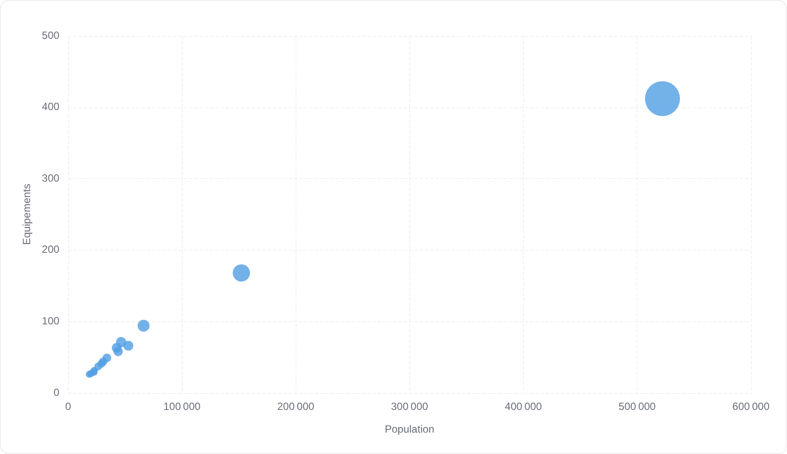
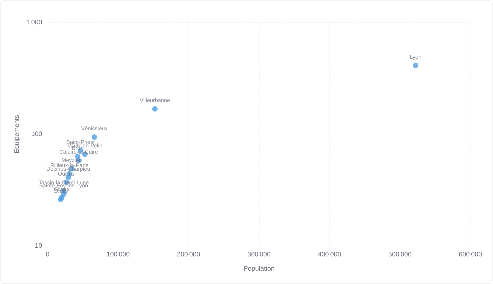
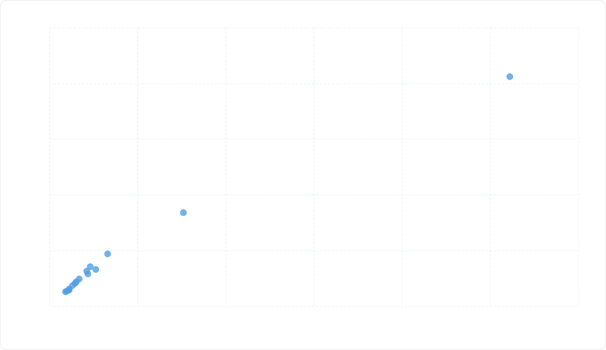

# Nuage de points

Deux mesures croisées, une ligne = un point. Avec un 3ᵉ champ, les points deviennent des bulles.

**Jeu de données :** `Commune, Population, Equipements` — 15 communes du Grand Lyon.

| Fichier | Variante | Ce qui change |
| --- | --- | --- |
| `01-defaut.png` | Défaut | Population en X, équipements en Y, points de taille fixe. |
| `02-avec-etiquettes.png` | Avec étiquettes | « Afficher les étiquettes des points » : chaque point porte le nom de sa commune. |
| `03-bulles.png` | Bulles | « Taille des bulles » branchée sur `Equipements` : le rayon porte une 3ᵉ information. |
| `04-echelle-log.png` | Échelle logarithmique | Axe Y logarithmique, pour écraser l'écart entre Lyon et les petites communes. |
| `05-sans-etiquettes-axes.png` | Sans étiquettes d'axes | Graduations coupées : il ne reste que le motif du nuage. |

---

### Défaut — `01-defaut.png`

Population en X, équipements en Y, points de taille fixe.

### Avec étiquettes — `02-avec-etiquettes.png`

« Afficher les étiquettes des points » : chaque point porte le nom de sa commune.

### Bulles — `03-bulles.png`

« Taille des bulles » branchée sur `Equipements` : le rayon porte une 3ᵉ information.

### Échelle logarithmique — `04-echelle-log.png`

Axe Y logarithmique, pour écraser l'écart entre Lyon et les petites communes.

### Sans étiquettes d'axes — `05-sans-etiquettes-axes.png`

Graduations coupées : il ne reste que le motif du nuage.

